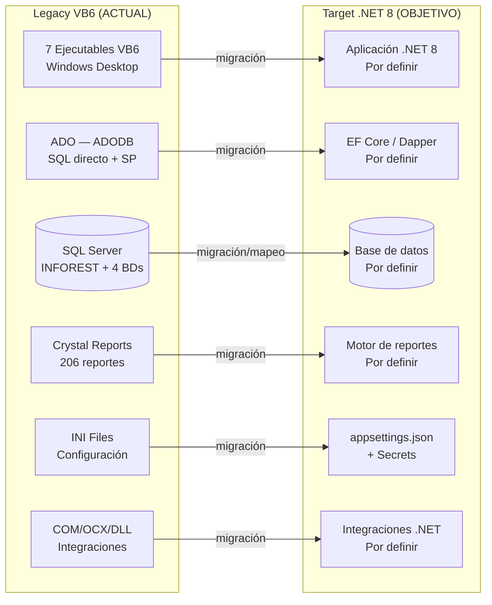

# Vista General de Arquitectura — INFOREST

> Comparativa Legacy vs Target para orientación rápida.

---

## Comparativa Legacy vs Target

---

## Estado de Cada Capa

| Capa | Legacy (Actual) | Target (Objetivo) | Estado |
|---|---|---|---|
| Presentación | VB6 Forms (401 frm) | Por definir | NOT_STARTED |
| Lógica de Aplicación | Módulos .bas (32) + Clases .cls (10) | Por definir | NOT_STARTED |
| Dominio | Mezclado en Forms/Módulos | Por definir | NOT_STARTED |
| Acceso a Datos | ADO inline + clsComando | Por definir | NOT_STARTED |
| Base de Datos | SQL Server 126T/105V/105+SP | Por definir | NOT_STARTED |
| Reportes | Crystal Reports (206) | Por definir | NOT_STARTED |
| Configuración | INI files (5+) | Por definir | NOT_STARTED |
| Integraciones | COM/OCX/DLL Win32 | Por definir | NOT_STARTED |
| Seguridad | XOR+César, Hardkey | Por definir | NOT_STARTED |
| Auditoría | INFSEGURIDAD BD | Por definir | NOT_STARTED |

---

## Referencias

- [Arquitectura Legacy](legacy-architecture.md)
- [Arquitectura Target](target-architecture.md)
- [Decisiones Arquitectónicas](architecture-decisions.md)
- [Estado de Migración](../migration/migration-status.md)
