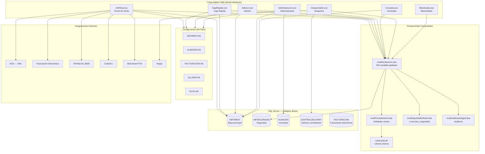
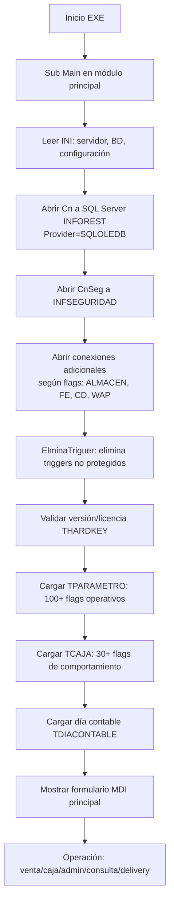

# Arquitectura Legacy — INFOREST VB6

> Status: CONFIRMED (análisis directo del código fuente en `legacy-restaurant/restaurant-vb6/`)
>
> Documento de referencia: [legacy-restaurant/README.md](../../legacy-restaurant/README.md) — análisis técnico completo de 1820 líneas.

---

## Resumen Ejecutivo

INFOREST Legacy es una aplicación **monolítica cliente-servidor** compuesta por **7 ejecutables VB6** que comparten una misma base de datos SQL Server. No existe separación formal en capas — UI, lógica de negocio y acceso a datos están mezclados dentro de los mismos formularios y módulos VB6.

---

## Diagrama de Arquitectura Legacy



---

## Ejecutables VB6

| Proyecto | EXE | Startup | Formularios | Módulos | Clases | Responsabilidad |
|---|---|---|---|---|---|---|
| `InfoRest.vbp` | `InfoRest.exe` | `Sub Main` en `modPuntoVenta` | ~120 | 18 | 10 | Punto de venta principal (salón, delivery, llevar) |
| `CajaRapida.vbp` | `CajaRapida.exe` | `Sub Main` en `modCajaRapida` | ~100 | 16 | 8 | Caja rápida, fast food |
| `Adicion.vbp` | `Adicion.exe` | `Sub Main` en `modAdicion` | 37 | 12 | 6 | Adición de ítems a pedidos existentes |
| `Administracion.vbp` | `Administracion.exe` | `Sub Main` en `modAdministracion` | 151 | 13 | 7 | Gestión administrativa, maestros, reportes |
| `Consulta.vbp` | `Consulta.exe` | `Sub Main` en `modConsulta` | 124 | 15 | 9 | Consultas gerenciales e informes |
| `Despachador.vbp` | `Despachador.exe` | `Sub Main` en `modDespachador` | 25 | 10 | 3 | Central de pedidos y despacho delivery |
| `Motorizados.vbp` | `Motorizado.exe` | `Sub Main` en `modMotorizado` | 2 | 7 | 3 | Operación de motorizados delivery |

---

## Capas (No Formales)

> El Legacy NO tiene separación formal en capas. La siguiente clasificación es una abstracción de la organización real:

```
┌─────────────────────────────────────────┐
│  UI Layer (mezclada con lógica)          │
│  Formularios/*.frm (401 forms)           │
│  MDI containers, forms de operación      │
└──────────────────┬──────────────────────┘
                   │ lógica dentro de forms
┌──────────────────▼──────────────────────┐
│  Logic Layer (distribuida en módulos)    │
│  Modulos/*.bas (32 módulos)              │
│  Clases/*.cls (10 clases)               │
│  modDeclaracion: 543 variables globales  │
└──────────────────┬──────────────────────┘
                   │ ADO directo
┌──────────────────▼──────────────────────┐
│  Data Access Layer (embebida)            │
│  ADODB.Connection, ADODB.Command         │
│  clsComando: wrapper de SP              │
│  Consultas SQL inline + SP              │
└──────────────────┬──────────────────────┘
                   │
┌──────────────────▼──────────────────────┐
│  Database Layer                          │
│  SQL Server (INFOREST, INFSEG, ALMACEN) │
│  126 tablas, 105 vistas, 105+ SP         │
└─────────────────────────────────────────┘
```

**IMPORTANTE:** Esta separación NO existe formalmente en el código. Los formularios contienen lógica de negocio directamente (SQL inline, llamadas a SP, validaciones de negocio).

---

## Módulos BAS — Inventario Completo

| Módulo | Archivo | Responsabilidad |
|---|---|---|
| Punto de Venta Main | `modPuntoVenta.bas` | Sub Main POS: INIs, conexiones, carga de parámetros |
| Caja Rápida Main | `modCajaRapida.bas` | Sub Main caja rápida |
| Adición Main | `modAdicion.bas` | Sub Main adición de comandas |
| Administración Main | `modAdministracion.bas` | Sub Main administración |
| Consulta Main | `modConsulta.bas` | Sub Main consultas |
| Consulta Integrada | `modConsultaIntregrada.bas` | Extensión multi-local |
| Despachador Main | `modDespachador.bas` | Sub Main despacho/delivery |
| Motorizado Main | `modMotorizado.bas` | Sub Main motorizados |
| **Declaraciones globales** | `modDeclaracion.bas` | **543 variables globales** — conexiones, flags, parámetros de sesión |
| **Procedimientos núcleo** | `modProcedimiento.bas` | Actualizador, motor FPay, integraciones, botones, QR |
| Procedimientos nuevos | `modProcedimientoNuevo.bas` | CashDro, extensiones |
| KDS | `modKDS.bas` | Armado XML KDS, comunicación con pantalla cocina |
| BlueVision | `modBlueVision.bas` | Integración TVS/BlueVision |
| Impresora Fiscal | `modImpresoraFiscal.bas` | Protocolo impresora fiscal Epson (Argentina) |
| Auditoría | `modAuditoria.bas` | Auditoría operativa |
| Auditoría Equipo | `modAuditoriaEquipo.bas` | Auditoría por terminal |
| Auditoría Integral | `modAuditoriaIntegral.bas` | Escritura en INFSEGURIDAD |
| Barcode | `modBarcode.bas` | Generación de códigos de barra |
| Seguridad Infhotel | `modSeguridadInfhotel.bas` | Licencias, alertas de vencimiento |
| Conexión IP | `modConexionIp.bas` | Ping, sockets TCP, conectividad |
| Crear INIs | `modCrearInis.bas` | Creación/verificación de archivos INI |
| Time | `modTime.bas` | Validación de fechas, control de versión |
| Masticar | `modMasticar.bas` | Procesamiento especial de datos (UNKNOWN) |
| Código Control | `CodigoControl.bas` | Código de control fiscal Bolivia (SIN) |
| DLL3500 | `DLL3500.bas` | Wrapper PinPad DLL3500 |
| FpLibX Const | `FpLibX_Const.bas` | Constantes biometría SecuGen |
| PictureBox Custom | `ModPictureBoxCustom.bas` | Extensiones PictureBox VB6 |
| HardKey | `ModuloHardKey.bas` | Dongle de licencia |
| VBZip | `VBZipBas.bas` | Compresión ZIP |
| CheffControl | `modCheffControl.bas` | Configuración chef control (cocina interactiva) |
| Guías | `modGuias.bas` | Guías de transporte |
| PvCorp | `modPvCorp.bas` | UNKNOWN — posiblemente punto de venta corporativo |

---

## Clases VB6 — Inventario Completo

| Clase | Archivo | Rol |
|---|---|---|
| `clsComando` | `Clases/clsComando.cls` | Wrapper ADODB.Command para SPs (timeout 600s) |
| `ClsDocumento` | `Clases/ClsDocumento.cls` | Operaciones de documentos/almacén |
| `clsAlmacen` | `Clases/clsAlmacen.cls` | Kardex, descargos, servicios almacén |
| `ClsSeguridad` | `Clases/ClsSeguridad.cls` | Cifrado XOR+César — **DÉBIL** |
| `clsDiaContable` | `Clases/clsDiaContable.cls` | Día contable activo |
| `claCorreoElectronico` | `Clases/claCorreoElectronico.cls` | Email vía Chilkat (alertas) |
| `clsxml` | `Clases/clsxml.cls` | Generación/lectura XMLs operativos |
| `clsTrama` | `Clases/clsTrama.cls` | Tramas protocolo FE Paperlees |
| `License` | `Clases/License.cls` | Validación licencia/hardkey |
| `Mapping` | `Clases/Mapping.cls` | Mapeo de datos (UNKNOWN propósito exacto) |

---

## Formularios — Categorías Principales

| Categoría | Cantidad Aprox. | Ejemplos |
|---|---|---|
| Operación / Venta | ~50 | `frmVenta`, `frmPedido`, `frmPago`, `frmPrecuenta`, `frmAdicion` |
| Caja | ~30 | `frmCaja`, `frmCajaRapida`, `frmCajaDetalle`, `frmCierre` |
| Documentos | ~20 | `frmFactura`, `frmNotaCredito`, `frmCambio` |
| Delivery | ~25 | `frmDelivery`, `frmBusquedaDelivery`, `frmDespachador`, `frmChofer` |
| Cocina/KDS | ~10 | `frmCheffControl`, `frmMensajeCocina` |
| Administración | ~80 | `frmProducto`, `frmInsumo`, `frmUsuario`, `frmArea`, `frmCaja` |
| Maestros | ~40 | `frmCliente`, `frmProveedor`, `frmMesa`, `frmGrupo` |
| Reportes | ~76 | `frmRepVenta`, `frmRepCaja`, `frmRepInventario` (`frmRep*`) |
| Utilidades | ~30 | `frmBusca`, `frmCalendario`, `frmBackup`, `frmUpdate` |
| MDI Containers | 7 | `mdiPuntoVenta`, `mdiAdministracion`, `mdiConsulta`, etc. |

---

## Archivos de Configuración (INI)

| Archivo | Propósito | Secciones Clave |
|---|---|---|
| `INFOREST.INI` | Configuración principal | Servidor, BD, caja, salón, empresa, rutas FE |
| `ALMACEN.INI` | Conexión a BD Almacén | Servidor, BD, credenciales |
| `FACTURACION.INI` | Configuración facturación electrónica | Proveedor FE, rutas, credenciales |
| `DLL3500.INI` | Configuración PinPad DLL3500 | Puerto, configuración terminal |
| `RUTA.INI` | Rutas de archivos del sistema | Directorios de operación |
| `INFHOTEL.INI` | Integración con sistema hotelero | UNKNOWN — sin evidencia suficiente |

---

## Dependencias Hardware

| Hardware | Módulo | Configuración |
|---|---|---|
| Impresora térmica | `TTIPODOCUMENTOIMPRESORA` | Por caja, área de impresión |
| Cajón de dinero | API puerto serial | `TCAJA` |
| CashDro (cajón automático) | `modProcedimientoNuevo.bas` | Timer 2s en `frmPago` |
| PinPad DLL3500 | `DLL3500.bas`, `CAJA_PINPAD.dll` | `DLL3500.INI` |
| Impresora fiscal Epson | `modImpresoraFiscal.bas`, `IFEpson.ocx` | Argentina |
| Biometría SecuGen | `FpLibX_Const.bas`, `sgfplibx.ocx` | Autenticación biométrica |
| KDS (pantalla cocina) | `modKDS.bas` | XML sobre directorio compartido |

---

## Dependencias COM/ActiveX/OCX

| Componente | Archivo | Uso |
|---|---|---|
| `MSCOMCTL.OCX` | MSCOMCTL.OCX | Controles VB6 comunes |
| `MCI32.OCX` | MCI32.OCX | Multimedia |
| `MSBIND.DLL` | MSBIND.DLL | Data binding |
| `IFEpson.ocx` | IFEpson.ocx | Impresora fiscal Epson (Argentina) |
| `CAJA_PINPAD.dll` | CAJA_PINPAD.dll | PinPad |
| Crystal Reports OCX | (no en repo) | Reportes Crystal Reports 6/9 |
| Chilkat Mail | (librería) | Email |
| BlueVision COM | `BlueVision_Core_TVS` | Display cliente |
| SecuGen biometría | `sgfplibx.ocx` | Biometría |

---

## Flujo de Arranque (Secuencia Común a Todos los Ejecutables)



---

## Riesgos de Seguridad Detectados

| Riesgo | Gravedad | Evidencia | Mitigación en Target |
|---|---|---|---|
| Credenciales SQL hardcodeadas en código fuente | CRÍTICO | `modPuntoVenta.bas` Sub Main | Secrets management en .NET |
| Cifrado débil XOR+César | ALTO | `ClsSeguridad.cls` | Implementar AES/BCrypt en .NET |
| Variables globales sin control de acceso | MEDIO | `modDeclaracion.bas` 543 vars | Inyección de dependencias en .NET |
| SQL inline en formularios (SQL injection posible) | ALTO | Múltiples `*.frm` | ORMs/parameterized queries en .NET |
| Licencia por dongle físico | BAJO | `License.cls`, `ModuloHardKey.bas` | Definir modelo de licenciamiento .NET |

---

## Referencias

- [Análisis técnico detallado](../../legacy-restaurant/README.md) — fuente primaria (1820 líneas)
- [Contexto del sistema](system-context.md)
- [Arquitectura Target](target-architecture.md)
- [Base de datos Legacy](../database/legacy-database.md)
