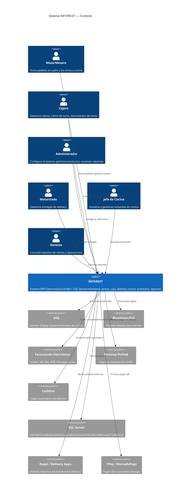

# Contexto del Sistema — INFOREST

> Status: CONFIRMED (basado en análisis del repositorio)

---

## Descripción del Sistema

INFOREST es un sistema ERP gastronómico que gestiona la operación completa de establecimientos de restauración. Funciona como una plataforma multi-ejecutable donde distintos operadores interactúan simultáneamente con el mismo sistema.

---

## Diagrama de Contexto (C4 — Nivel 1)

---

## Usuarios del Sistema

| Actor | Ejecutable Principal | Funciones Principales |
|---|---|---|
| Mozo/Mesero | `InfoRest.exe` | Toma de pedidos, gestión de mesas, envío a cocina |
| Cajero | `InfoRest.exe`, `CajaRapida.exe` | Cobro, emisión de documentos, cierre de turno |
| Administrador | `Administracion.exe` | Configuración, maestros, usuarios, reportes administrativos |
| Operador de Adición | `Adicion.exe` | Agregado de ítems a pedidos en curso |
| Despachador | `Despachador.exe` | Central de pedidos delivery, asignación a motorizados |
| Motorizado | `Motorizado.exe` | Seguimiento de entregas a domicilio |
| Jefe de Cocina | `InfoRest.exe` (frmCheffControl) | Visualización y control de comandas |
| Gerente/Consultor | `Consulta.exe` | Consultas e informes de gestión |

---

## Sistemas Externos Integrados

| Sistema | Tipo | Tecnología Legacy | Módulo VB6 | Estado |
|---|---|---|---|---|
| KDS | Pantalla cocina | XML sobre directorio compartido | `modKDS.bas` | CONFIRMED |
| BlueVision/TVS | Display cliente | COM `BlueVision_Core_TVS` | `modBlueVision.bas` | CONFIRMED |
| Facturación Electrónica | Fiscal | Múltiples (por país) | `ClsDocumento.cls`, SP FE | CONFIRMED |
| PinPad DLL3500 | Pago tarjeta | `CAJA_PINPAD.dll` | `DLL3500.bas` | CONFIRMED |
| CashDro | Cajón automático | API HTTP (timer 2s) | `modProcedimientoNuevo.bas` | CONFIRMED |
| Rappi | Delivery externo | SP dedicado | `modDespachador.bas` | CONFIRMED |
| FPay / MercadoPago QR | Pago QR | `usp_EjecutaMotorServiciosFPAY` | `modProcedimiento.bas` | CONFIRMED |
| Impresora Fiscal Epson | FE Argentina | `ifepson.ocx` | `modImpresoraFiscal.bas` | CONFIRMED |
| Biometría SecuGen | Seguridad | `sgfplibx.ocx` | `FpLibX_Const.bas` | CONFIRMED |
| Chilkat Mail | Email | Librería Chilkat | `claCorreoElectronico.cls` | CONFIRMED |
| APIs RUC/DNI | Consulta fiscal | HTTP | `FrmConsultaRUC.frm` | CONFIRMED |

---

## Restricciones del Contexto

| Restricción | Descripción | Estado |
|---|---|---|
| Multi-país | Scripts SQL y lógica específica por país | CONFIRMED |
| Multi-local | Configuración `AdministracionCentralizada=ON` en INI | CONFIRMED |
| Hardware dependiente | Impresoras térmicas, cajones, PinPads, biometría | CONFIRMED |
| Windows only (Legacy) | COM/ActiveX requieren Windows | CONFIRMED |
| Licencia por hardware | Dongle físico validado por `License.cls` | CONFIRMED |
| Credenciales embebidas | Credenciales SQL en código fuente VB6 | CONFIRMED — riesgo de seguridad |

---

## Referencias

- [Análisis técnico del Legacy](../../legacy-restaurant/README.md)
- [Arquitectura Legacy](legacy-architecture.md)
- [Decisiones arquitectónicas](architecture-decisions.md)
