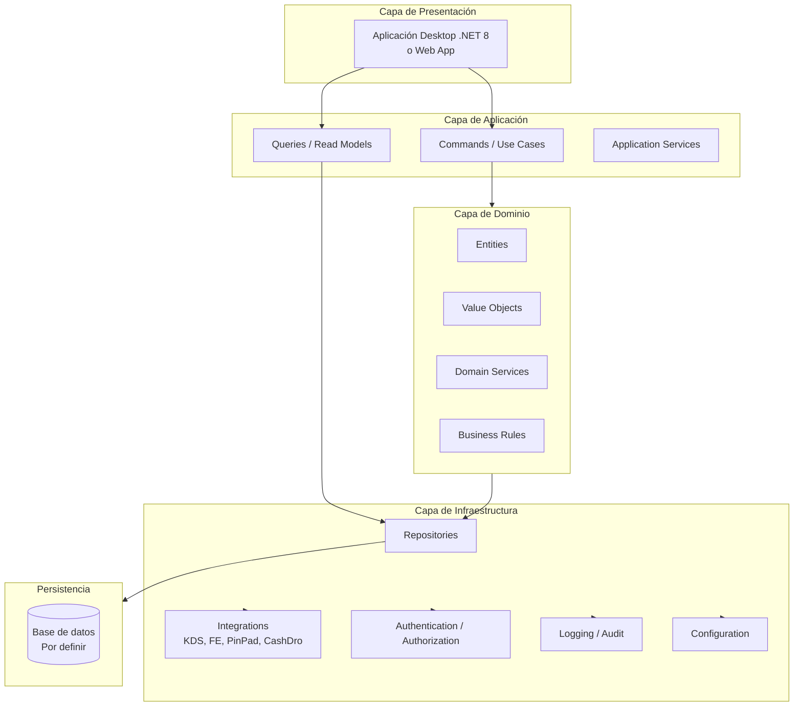

# Arquitectura Objetivo — INFOREST .NET 8

> Status: NOT_STARTED
>
> **IMPORTANTE:** La carpeta `modern-net8/` existe pero está vacía. No existe código .NET 8 en el repositorio. Este documento define la arquitectura PROPUESTA basada en las mejores prácticas de .NET 8 y los requisitos conocidos del sistema Legacy. Todas las decisiones arquitectónicas están en estado `Proposed` hasta ser aceptadas formalmente.

---

## Estado Actual

```
modern-net8/
└── README.md    ← Solo contiene placeholder "# Sistema — Restaurant - moderno"
```

**No existe implementación .NET 8.**

---

## Objetivos de la Arquitectura Target

La nueva arquitectura debe preservar y modernizar:

1. **Toda la funcionalidad del Legacy** (fuente de verdad)
2. **Todas las reglas de negocio** documentadas en `docs/migration/business-rules.md`
3. **Integraciones existentes** (KDS, FE, PinPad, etc.)
4. **Soporte multi-país** (Perú, Chile, Bolivia, Ecuador, Argentina, España)
5. **Soporte multi-local** (administración centralizada)

Mejoras objetivo:

- Eliminar hardcoding de credenciales SQL
- Eliminar cifrado débil
- Reducir acoplamiento entre módulos
- Habilitar pruebas automatizadas
- Mejorar mantenibilidad y escalabilidad
- Habilitar despliegue moderno (CI/CD)

---

## Arquitectura Propuesta (Referencia)

> Status: `Proposed` — pendiente de decisión formal (ver [ADR-001](architecture-decisions.md))



---

## Decisiones Arquitectónicas Pendientes

Las siguientes decisiones NO han sido tomadas aún:

| Decisión | Opciones | Estado |
|---|---|---|
| Tipo de aplicación | Web App / Desktop WinForms / Desktop WPF / MAUI | UNKNOWN |
| Base de datos target | SQL Server / PostgreSQL / otra | UNKNOWN |
| ORM | Entity Framework Core / Dapper / otro | UNKNOWN |
| Patrón arquitectónico | Clean Architecture / DDD / CQRS / N-Layer | UNKNOWN |
| Autenticación | JWT / Identity / OAuth2 | UNKNOWN |
| Comunicación inter-módulos | Monolito modular / Microservicios / SOA | UNKNOWN |
| Estrategia de reportes | Crystal Reports .NET / SSRS / otro | UNKNOWN |
| Hardware abstraction | Interfaces .NET / drivers nativos | UNKNOWN |

---

## Módulos a Implementar

Basados en los ejecutables Legacy:

| Módulo | Ejecutable Legacy | Prioridad Estimada | Estado |
|---|---|---|---|
| Punto de Venta | `InfoRest.exe` | Alta | NOT_STARTED |
| Caja y Pagos | `InfoRest.exe` + `CajaRapida.exe` | Alta | NOT_STARTED |
| Cocina/KDS | `InfoRest.exe` (frmCheffControl) | Alta | NOT_STARTED |
| Delivery | `Despachador.exe` | Media | NOT_STARTED |
| Administración | `Administracion.exe` | Media | NOT_STARTED |
| Consultas/Reportes | `Consulta.exe` | Media | NOT_STARTED |
| Motorizados | `Motorizado.exe` | Baja | NOT_STARTED |
| Adición | `Adicion.exe` | Media | NOT_STARTED |

---

## Integraciones a Migrar

| Integración | Legacy | Target | Estado |
|---|---|---|---|
| KDS | XML sobre directorio | Por definir (HTTP/SignalR?) | UNKNOWN |
| Facturación Electrónica | Múltiples SDKs por país | Por definir | UNKNOWN |
| PinPad DLL3500 | DLL Win32 | Por definir | UNKNOWN |
| CashDro | API HTTP timer | Por definir | UNKNOWN |
| BlueVision/TVS | COM ActiveX | Por definir | UNKNOWN |
| Rappi | SP dedicado | Por definir | UNKNOWN |
| FPay/MercadoPago QR | SP + motor | Por definir | UNKNOWN |
| Biometría | OCX Win32 | Por definir | UNKNOWN |
| Impresora Fiscal Epson | OCX Win32 | Por definir | UNKNOWN |

---

## Requisitos No Funcionales Conocidos

Extraídos del análisis del Legacy:

| Requisito | Evidencia en Legacy | Target |
|---|---|---|
| Multi-país (impuestos, FE) | Scripts SQL opcionales por país | Configuración por país/tenant |
| Multi-local (centralizado) | Flag `CENTRALIZADA=ON` en INI | Multi-tenant o multi-instancia |
| Hardware POS (impresoras, cajones) | Múltiples módulos de hardware | Abstracción de hardware .NET |
| Alta disponibilidad operativa | Timers críticos en operación | Por definir |
| Auditoría de operaciones | `modAuditoriaIntegral.bas` | Logging + Audit trail |
| Seguridad de acceso | `TGRUPOUSUARIO`, `TACCESO` | RBAC .NET |
| Rendimiento tiempo real | Timers 250ms–10000ms | SignalR / background services |

---

## Principios de la Nueva Arquitectura

> Estos principios se aplicarán en la implementación Target:

1. **Separación explícita de responsabilidades** — UI, Application, Domain, Infrastructure
2. **Sin credenciales embebidas** — Secrets management (Azure Key Vault, environment variables)
3. **Sin cifrado débil** — BCrypt para passwords, AES para datos sensibles
4. **Pruebas automatizadas** — Unit tests para dominio, Integration tests para infraestructura
5. **Trazabilidad completa** — Cada componente Legacy tiene equivalente Target documentado
6. **Código Legacy = fuente de verdad funcional** — No inventar comportamiento
7. **Configuración externalizada** — `appsettings.json` + environment variables
8. **Logging estructurado** — Serilog o equivalente

---

## Referencias

- [Arquitectura Legacy](legacy-architecture.md)
- [Decisiones arquitectónicas](architecture-decisions.md)
- [Estrategia de migración](../migration/migration-strategy.md)
- [Estado de migración](../migration/migration-status.md)
