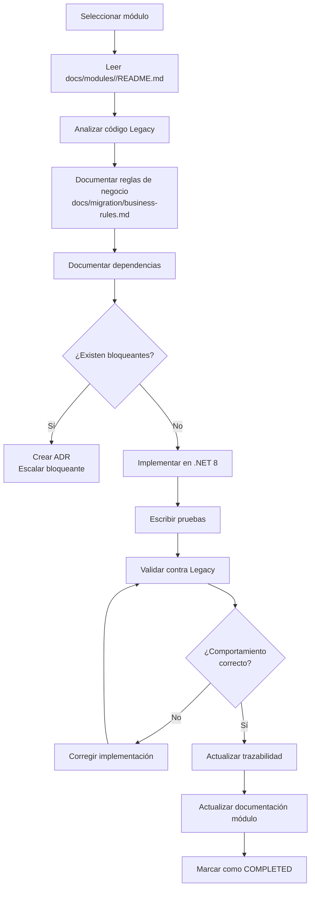

# Reglas de Migración — INFOREST

> Reglas y estándares que rigen el proceso de migración INFOREST VB6 → .NET 8.

---

## Regla Fundamental

> **El código Legacy VB6 es la fuente de verdad funcional hasta que una decisión de negocio o arquitectura documentada establezca explícitamente un comportamiento diferente.**

---

## Reglas del Proceso

### R-001 — Documentar antes de migrar

Antes de iniciar la migración de cualquier componente:
1. Documentar la funcionalidad Legacy en `docs/modules/<modulo>/`
2. Identificar todas las reglas de negocio
3. Identificar todas las dependencias
4. Actualizar `docs/migration/traceability-matrix.md`

### R-002 — No inventar comportamiento

Si el comportamiento de un componente Legacy no es claro, marcarlo como `UNKNOWN` y solicitar aclaración antes de implementar.

### R-003 — No modificar código Legacy

Durante la migración NO se modifica:
- Código VB6 (.frm, .bas, .cls, .vbp)
- Scripts SQL funcionales
- APIs o contratos existentes
- Nombres de tablas (sin ADR aprobado)
- Comportamiento en producción

### R-004 — Trazabilidad obligatoria

Cada componente migrado DEBE tener entrada en `docs/migration/traceability-matrix.md` antes de considerarse completado.

### R-005 — Pruebas obligatorias

Cada módulo migrado DEBE tener:
- Pruebas unitarias para reglas de negocio del dominio
- Pruebas de integración para acceso a datos
- Validación de comportamiento contra Legacy

### R-006 — Actualizar documentación

Después de cada migración, actualizar:
- `docs/migration/traceability-matrix.md`
- `docs/migration/migration-status.md`
- `docs/modules/<modulo>/migration-status.md`
- `docs/modules/<modulo>/README.md`

### R-007 — Estados válidos de migración

Solo usar estados predefinidos:

```
NOT_STARTED   — No iniciado
ANALYSIS      — En análisis, no comenzada implementación
IN_PROGRESS   — Implementación en curso
MIGRATED      — Implementado, pendiente de validación
VALIDATING    — En proceso de validación
COMPLETED     — Validado y documentado
BLOCKED       — Bloqueado por dependencia o decisión
NOT_APPLICABLE — No aplica migración
UNKNOWN       — Estado no determinable
```

### R-008 — Sin ambigüedades de estado

No usar:
- "Listo", "Casi listo", "Parece migrado", "Probablemente migrado"
- Estimaciones sin base ("aprox 80%")

### R-009 — ADR para cambios de comportamiento

Si durante la migración se detecta que el comportamiento Legacy debe cambiarse (por razones técnicas, de seguridad o negocio), crear un ADR en `docs/architecture/architecture-decisions.md` antes de implementar el cambio.

### R-010 — Seguridad no negociable

Los siguientes elementos del Legacy NO se replican en el Target:
- Credenciales SQL hardcodeadas
- Cifrado débil XOR+César
- SQL inline sin parametrizar (injection risk)

Estos requieren implementación segura desde el inicio.

---

## Convenciones de Nomenclatura

### Formato de IDs de Reglas de Negocio

```
BR-XXX
```
Donde XXX es número secuencial de 3 dígitos. Ejemplo: `BR-001`, `BR-042`.

### Formato de ADRs

```
ADR-XXX
```
Donde XXX es número secuencial. Ejemplo: `ADR-001`.

---

## Flujo de Trabajo por Módulo



---

## Referencias

- [Estrategia de migración](migration-strategy.md)
- [Trazabilidad](traceability-matrix.md)
- [Instrucciones Copilot](../../.github/copilot-instructions.md)
