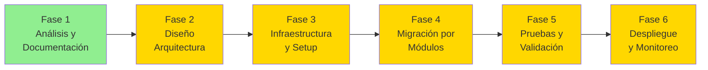

# Estrategia de Migración — INFOREST VB6 → .NET 8

> Status: PARTIAL — estrategia propuesta basada en análisis del sistema Legacy. Pendiente de validación formal.

---

## Principios Fundamentales

1. **El código Legacy es la fuente de verdad funcional** — No se inventa comportamiento.
2. **Preservación de funcionalidad** — Toda funcionalidad Legacy debe estar en el Target.
3. **Trazabilidad completa** — Cada componente Legacy debe tener equivalente documentado.
4. **Cero regresiones** — El sistema Target no debe perder funcionalidad del Legacy.
5. **Migración no es conversión** — El objetivo es modernizar, no solo convertir VB6 a C#.

---

## Fases de Migración



| Fase | Descripción | Estado |
|---|---|---|
| 1 | Análisis y Documentación del Legacy | IN_PROGRESS |
| 2 | Diseño de Arquitectura .NET 8 | NOT_STARTED |
| 3 | Infraestructura: proyecto, CI/CD, BD | NOT_STARTED |
| 4 | Migración por módulos (iterativa) | NOT_STARTED |
| 5 | Pruebas y validación contra Legacy | NOT_STARTED |
| 6 | Despliegue y monitoreo en producción | NOT_STARTED |

---

## Estrategia de Migración Propuesta: Strangler Fig Pattern

> Status: Proposed (ver [ADR-004](../architecture/architecture-decisions.md#adr-004))

```mermaid
flowchart TB
    subgraph Transition["Período de Transición"]
        LGC[Sistema Legacy VB6\n(operación actual)]
        NW[Sistema .NET 8\n(módulos migrados)]
        LGC <-->|datos compartidos\nSQL Server| NW
    end

    USR[Usuarios] --> LGC
    USR --> NW
```

**Principio:** Los módulos se migran uno a uno. El sistema Legacy continúa operando para los módulos no migrados. La base de datos actúa como punto de integración durante la transición.

---

## Orden de Migración Propuesto

> Basado en complejidad, criticidad y dependencias identificadas. Sujeto a revisión.

| Prioridad | Módulo | Razón | Dependencias |
|---|---|---|---|
| 1 | Infraestructura base (.NET 8 project, BD, auth) | Todo lo demás depende de esto | — |
| 2 | Maestros (Productos, Grupos, Clientes) | Base para todos los demás módulos | BD, Auth |
| 3 | Punto de Venta (Salón) | Core del negocio | Maestros, BD, KDS, Impresoras |
| 4 | Caja y Pagos | Crítico para operación | POS, BD, PinPad, FE |
| 5 | Cocina / KDS | Dependiente del POS | POS, KDS HW |
| 6 | Delivery y Despachador | Módulo independiente | Maestros, BD |
| 7 | Administración | Menor urgencia operativa | Maestros, BD |
| 8 | Reportes y Consultas | Puede usar BD Legacy | BD, Motor reportes |
| 9 | Motorizados | Módulo pequeño | Delivery |

---

## Criterio de Completitud por Módulo

Un módulo se considera **COMPLETADO** cuando:

```
☐ 1. Todos los formularios Legacy tienen equivalente .NET
☐ 2. Todas las reglas de negocio están implementadas y documentadas
☐ 3. Todas las dependencias de BD están implementadas
☐ 4. Los Stored Procedures relevantes están migrados o encapsulados
☐ 5. Las integraciones de hardware están funcionando
☐ 6. Pruebas unitarias cubren las reglas de negocio
☐ 7. Pruebas de integración validan el comportamiento
☐ 8. Comportamiento validado contra el Legacy
☐ 9. Trazabilidad actualizada en traceability-matrix.md
☐ 10. Documentación del módulo actualizada
```

**Código moderno ≠ migración completa.**

---

## Gestión de Riesgos

| Riesgo | Probabilidad | Impacto | Mitigación |
|---|---|---|---|
| Reglas de negocio ocultas en código VB6 | Alta | Alto | Análisis exhaustivo + parallel run |
| Hardware POS sin equivalente .NET | Media | Alto | Definir abstracción de hardware temprano |
| 206 reportes Crystal Reports | Alta | Medio | Definir estrategia de reportes en ADR-007 |
| Multi-país: diferencias fiscales | Media | Alto | Pruebas por país específicas |
| Credenciales hardcodeadas Legacy | Alta (ya existe) | Alto | Implementado en Target desde inicio |
| Comportamiento de SPs complejos | Media | Alto | Documentar y probar individualmente |

---

## Referencias

- [Estado de Migración](migration-status.md)
- [Decisiones Arquitectónicas](../architecture/architecture-decisions.md)
- [Brechas Conocidas](known-gaps.md)
- [Análisis Legacy](../../legacy-restaurant/README.md)
