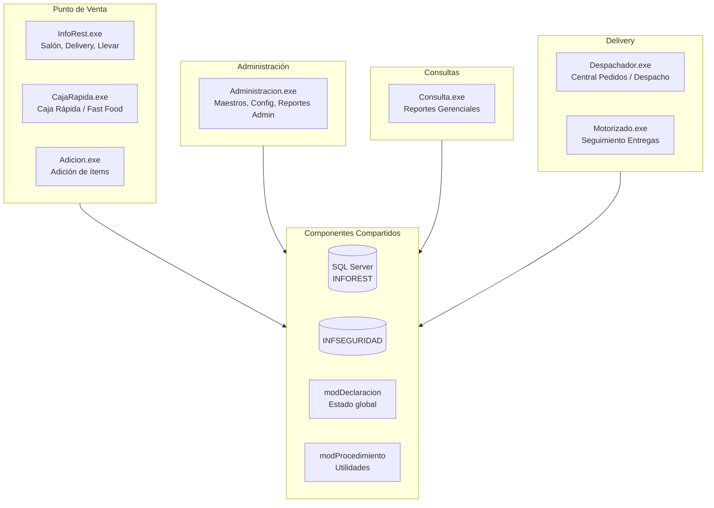

# Módulos — INFOREST

> Documentación de los módulos funcionales del sistema INFOREST.

---

## Módulos del Sistema

| Módulo | Ejecutable Legacy | Documentación | Estado |
|---|---|---|---|
| Restaurante (POS + Admin + Delivery) | Todos los ejecutables | [restaurante/](restaurante/README.md) | PARTIAL — análisis en curso |

---

## Estructura de Módulos Legacy

El sistema Legacy está organizado en módulos funcionales que corresponden a 7 ejecutables. Todos comparten la misma base de datos y componentes comunes.

---

## Notas

- Todos los módulos están documentados inicialmente en [restaurante/README.md](restaurante/README.md)
- A medida que avance la migración, cada módulo tendrá su propia subcarpeta
- La documentación detallada del Legacy está en [legacy-restaurant/README.md](../../legacy-restaurant/README.md)
