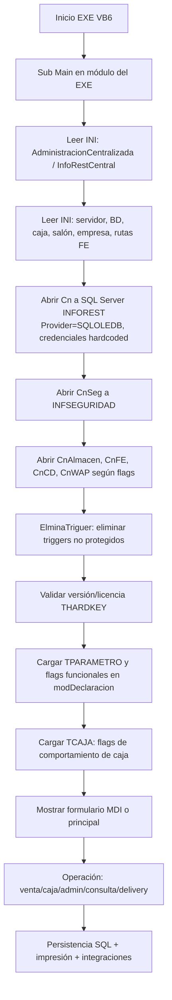
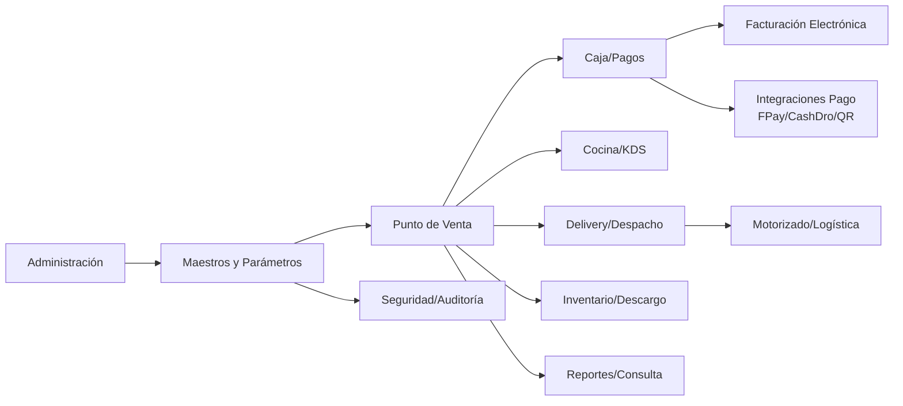
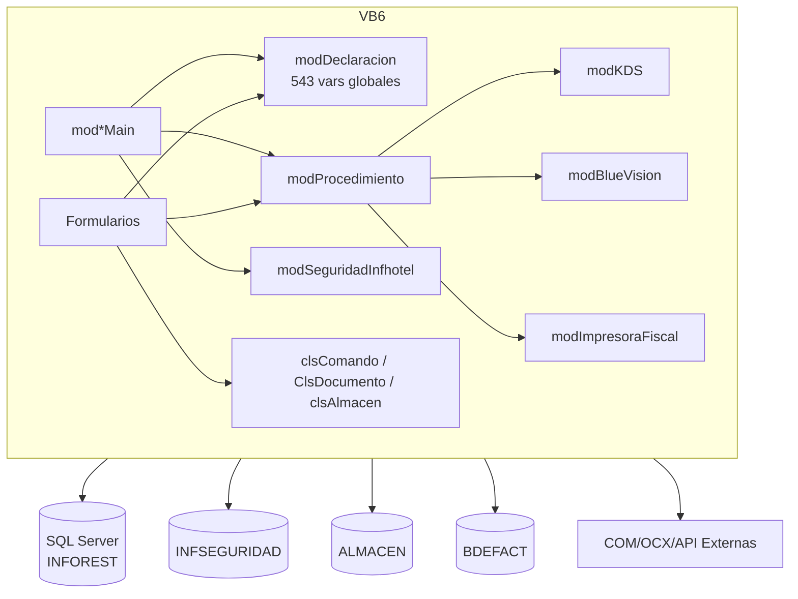
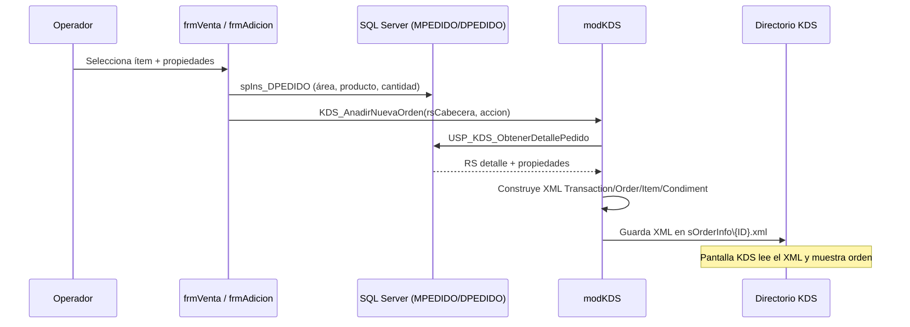
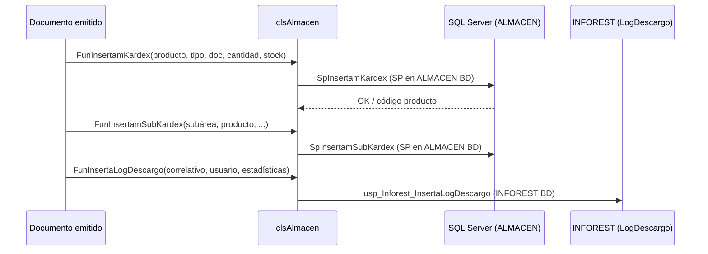
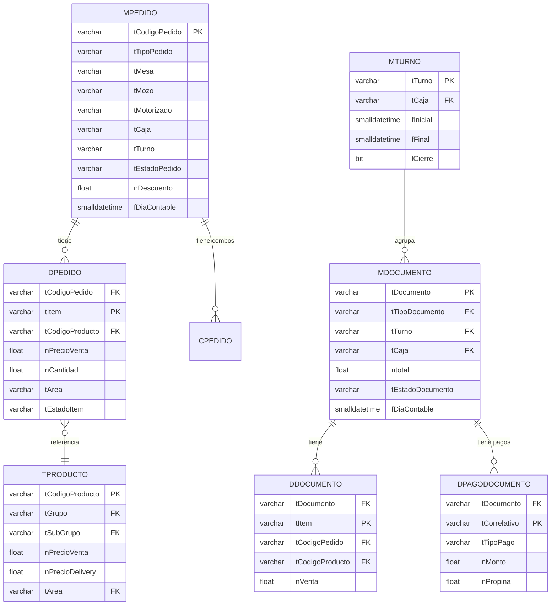
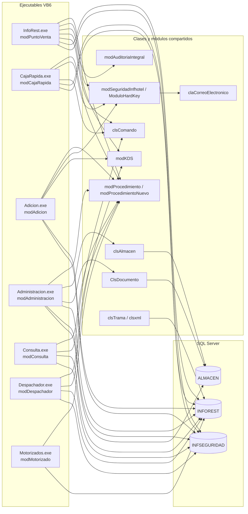
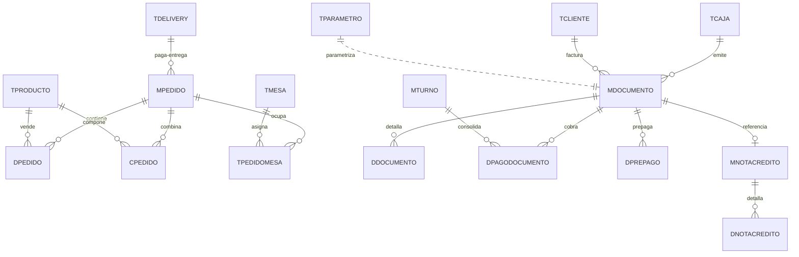
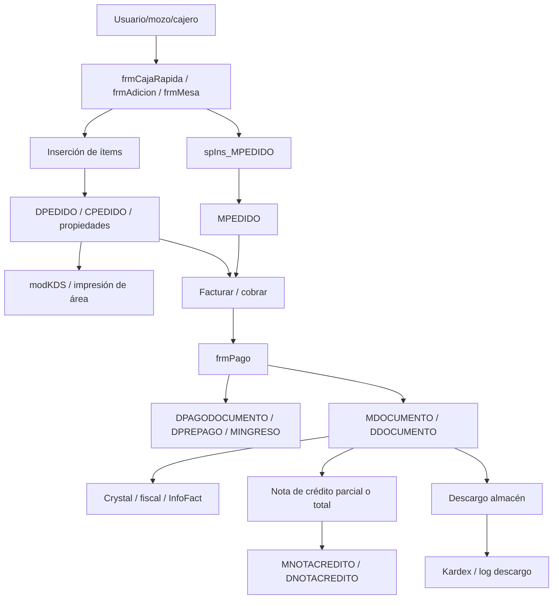

# Sistema Legacy — Restaurant

## Información General

| Campo | Valor |
|-------|-------|
| **Sistema** | Restaurant Management System |
| **Tecnología** | Visual Basic 6.0 + SQL Server |
| **Estado de Migración** | En análisis |
| **Ruta analizada** | `/home/runner/work/cloud-platform/cloud-platform/legacy/restaurant` |
| **Artefactos principales** | 7 ejecutables VB6, 400 formularios, 37 módulos BAS, 10 clases CLS, 15 scripts SQL |

## Descripción

Sistema legacy de gestión de restaurante desarrollado en VB6 con base de datos SQL Server. Cubre operaciones de venta en salón, caja, delivery, documentos de venta, inventario, auditoría y reportes.

## Funcionalidades Documentadas

- Gestión de mesas y salones.
- Toma de pedidos y comandas.
- Comunicación con cocina.
- Caja y cierre de turno.
- Inventario básico.
- Reportes de ventas.
- Delivery y despacho de pedidos.
- Integración de facturación electrónica y servicios externos.

## Estado del Análisis

Análisis técnico realizado directamente sobre código fuente y scripts SQL en:
- `restaurant-vb6/*.vbp`
- `restaurant-vb6/Formularios/*.frm`
- `restaurant-vb6/Modulos/*.bas`
- `restaurant-vb6/Clases/*.cls`
- `database/*.sql`
- `database/opcionales/*.sql`

> Si algún detalle no aparece en estos artefactos, se marca como **“no determinable con certeza”**.

---

## 1) Arquitectura encontrada

### 1.1 Estilo arquitectónico

Arquitectura **monolítica cliente-servidor VB6 + SQL Server**, separada en múltiples ejecutables por dominio operativo:

- `InfoRest.exe` (Punto de venta principal)
- `CajaRapida.exe`
- `Adicion.exe`
- `Administracion.exe`
- `Consulta.exe`
- `Despachador.exe`
- `Motorizado.exe`

Todos comparten:
- Configuración por INI
- Conexión ADO (`SQLOLEDB`) a SQL Server
- Variables globales en `modDeclaracion.bas`
- Librería interna `Libreria16.dll`
- Lógica reusable en `modProcedimiento.bas`

### 1.2 Componentes

| Componente | Evidencia | Rol técnico |
|---|---|---|
| Capa UI VB6 | `Formularios/*.frm`, `mdi*.frm` | Interacción operador/cajero/administrador |
| Capa lógica VB6 | `Modulos/*.bas`, `Clases/*.cls` | Reglas operativas, impresión, integración, seguridad |
| Capa datos | `ADODB.Connection`, `Lib.OpenRecordset`, `Cn.Execute` | Acceso SQL directo + SP + vistas |
| Capa configuración | `INFOREST.INI`, `ALMACEN.INI`, `FACTURACION.INI`, `DLL3500.INI`, `TIEMPO.INI` | Parámetros runtime y conectividad |
| Capa reportes | `Reportes/*.dsr`, `*.dca`, `*.dsx` + Crystal | Salidas operativas/contables/gerenciales |
| Capa integraciones | módulos `modKDS`, `modBlueVision`, `modImpresoraFiscal`, SP FE | Integración con cocina, FE, pago y terceros |

### 1.3 Flujo general de arranque

> **Nota:** Las credenciales SQL están codificadas directamente como constantes literales en `modPuntoVenta.bas` Sub Main(). Todos los módulos ejecutables usan las mismas credenciales embebidas. Ver §7 para el análisis de riesgo.

### 1.4 Organización del proyecto

| Carpeta | Contenido |
|---|---|
| `restaurant-vb6/` | Proyectos VB6, INI, OCX locales |
| `restaurant-vb6/Formularios/` | 400 formularios |
| `restaurant-vb6/Modulos/` | 37 módulos BAS |
| `restaurant-vb6/Clases/` | 10 clases |
| `restaurant-vb6/Reportes/` | Definiciones de reportes |
| `database/` | Estructura, PK, vistas, SP, scripts de actualización |
| `database/opcionales/` | Seguridad, scripts por país, soporte |

### 1.5 Dependencias internas

- Módulos de entrada (`modPuntoVenta`, `modCajaRapida`, `modAdicion`, `modAdministracion`, `modConsulta`, `modDespachador`, `modMotorizado`) dependen de:
  - `modDeclaracion`
  - `modProcedimiento`
  - `modSeguridadInfhotel`
  - `modAuditoriaIntegral`
- `clsComando` encapsula invocación de SP ADO.
- `clsAlmacen` y `ClsDocumento` encapsulan operaciones de almacén/documentos.

### 1.6 Dependencias externas

- SQL Server (INFOREST, INFSEGURIDAD, ALMACEN, CENTRALDELIVERY, FACTURACION)
- Crystal Reports (6 y 9)
- ActiveX/OCX de UI/comunicaciones
- Librerías de biometría (DigitalPersona, SecuGen)
- Librerías Chilkat Mail
- APIs HTTP de consulta RUC/DNI
- Integraciones KDS/BlueVision/FE/terminales de pago

---

## 2) Ingeniería inversa

### 2.1 Módulos ejecutables (VBP)

| Proyecto | EXE | Startup | Formularios | Módulos | Clases |
|---|---|---|---:|---:|---:|
| InfoRest.vbp | InfoRest.exe | Sub Main | 120 | 18 | 10 |
| CajaRapida.vbp | CajaRapida.exe | Sub Main | 100 | 16 | 8 |
| Adicion.vbp | Adicion.exe | Sub Main | 37 | 12 | 6 |
| Administracion.vbp | Administracion.exe | Sub Main | 151 | 13 | 7 |
| Consulta.vbp | Consulta.exe | Sub Main | 124 | 15 | 9 |
| Despachador.vbp | Despachador.exe | Sub Main | 25 | 10 | 3 |
| Motorizados.vbp | Motorizado.exe | Sub Main | 2 | 7 | 3 |

### 2.2 Responsabilidad de módulos BAS

| Módulo | Responsabilidad inferida | SP/APIs clave usados |
|---|---|---|
| `modPuntoVenta` | Sub Main del POS: lee INIs, abre conexiones (INFOREST, INFSEGURIDAD, FACTURACIÓN, ALMACÉN, CD, WebApp), carga TPARAMETRO, abre mdiPuntoVenta | `TPARAMETRO`, `TCAJA`, `MTURNO` |
| `modCajaRapida` | Sub Main de caja rápida; inicio idéntico a PuntoVenta con variantes de caja rápida | Mismo stack de conexión |
| `modAdicion` | Sub Main de módulo de adición de comandas rápidas | Conexiones locales |
| `modAdministracion` | Sub Main de administración; conecta también a ALMACEN para gestión de stock | SP de administración |
| `modConsulta` | Sub Main de módulo de consultas e integradas | SP `spRep_*` |
| `modConsultaIntregrada` | Extensión de consulta para múltiples locales | SP integrados |
| `modDespachador` | Sub Main de despacho y central de pedidos | `SP_DepachoPedidosRappi`, vistas delivery |
| `modMotorizado` | Sub Main para operación de motorizados | `spRep_ControlMotorizado` |
| `modDeclaracion` | **543 variables públicas globales** (conexiones, flags funcionales, parámetros de sesión, configuración de periféricos) | — (declaraciones) |
| `modProcedimiento` | Utilidades núcleo: actualizador (`IniciarActualizador`), motor FPay (`EjecutaMotorFPAY`), motor integraciones (`EjecutaMotorIntegraciones`), matrices de botones, QR codes, eliminación de triggers (`ElminaTriguer`) | `usp_EjecutaMotorServiciosFPAY`, `Usp_EjecutaMotorServicios` |
| `modProcedimientoNuevo` | Extensiones: integración CashDro, funciones nuevas de comportamiento | CashDro API |
| `modKDS` | Armado de XML estándar KDS por pedido/ítem/condimento/estación; soporta múltiples modelos KDS | `USP_KDS_ObtenerDetallePedidox`, escribe `.xml` en directorio configurado |
| `modBlueVision` | Integración TVS/BlueVision: autenticación, envío de ticket, líneas de ticket, control events, logging | `BlueVision_Core_TVS` COM, `BLUEVISION.INI` |
| `modImpresoraFiscal` | Flujo completo de impresora fiscal Epson Argentina: SetPaperSize, SetPreference, SetZone, facturas A/B/C | `ifepson.ocx` (PrinterFiscal) |
| `modBarcode` | Generación de códigos de barras lineales | — |
| `modSeguridadInfhotel` | Validación de licencias, envío de correos de alerta/vencimiento de licencias | `claCorreoElectronico`, `THARDKEY` |
| `modAuditoriaIntegral` | Escritura en `MMOVIMIENTO` y `MMOVIMIENTOACCESO` (INFSEGURIDAD) | `ups_Aud_*` |
| `modAuditoria` | Auditoría adicional (posiblemente para almacén) | — |
| `modAuditoriaEquipo` | Auditoría a nivel de equipo/terminal | — |
| `modConexionIp` | Ping, sockets TCP para verificar conectividad de red | WinSock/API red |
| `modCrearInis` | Crea/verifica archivos INI de configuración al iniciar | `kernel32.dll` WritePrivateProfileString |
| `modTime` | Validación de fechas de archivos y control de versión para actualizaciones | API de archivos |
| `modMasticar` | Procesamiento especial de datos (propósito exacto no determinable con certeza) | — |
| `CodigoControl` | Algoritmos de código de control (Bolivia: código de control fiscal) | — |
| `DLL3500` | Wrapper para comunicación con terminal PinPad DLL3500 | `DLL3500.INI` |
| `FpLibX_Const` | Constantes para librería biométrica SecuGen FpLibX | `sgfplibx.ocx` |
| `ModPictureBoxCustom` | Extensiones de comportamiento de PictureBox | — |
| `ModuloHardKey` | Gestión de hardware key (dongle) de licencia | — |
| `VBZipBas` | Compresión ZIP en VB6 | — |
| `modCheffControl` | Configuración y comportamiento de Chef Control (pantalla de cocina interactiva) | — |
| `modGuias` | Módulo de guías de transporte | `Usp_GuiaTransporteXml` |

### 2.3 Clases principales

| Clase | Rol | Métodos clave |
|---|---|---|
| `clsComando` | Wrapper de `ADODB.Command` para invocar SP con parámetros tipados; timeout de 600 s | `CreateCmdSp`, `CreateParameter`, `ExecSP`, `GetSP`, `GetParameterValue`, `DelSp` |
| `ClsDocumento` | Operaciones de documentos de compra/almacén (ALMACEN BD) | `InsmDocumento`, `InsUpdDocumentoC`, `InsUpdmDocumento`, `HistorialCompra`, `VerificaModificacion` |
| `clsAlmacen` | Kardex, descargos y servicios de almacén; soporta almacén local y remoto | `FunInsertamKardex`, `FunInsertamSubKardex`, `FunInsertaLogDescargo`, `EjecutarDescargoAutomatico` |
| `ClsSeguridad` | Cifrado/descifrado simple XOR+César con clave de defecto conocida — **débil** | `TextEncript`, `TextDecript` |
| `clsDiaContable` | Obtención e inserción del día contable activo | — |
| `claCorreoElectronico` | Envío de correos electrónicos vía Chilkat (alertas de licencia, notificaciones) | — |
| `clsxml` | Generación y lectura de XMLs operativos | — |
| `clsTrama` | Armado y lectura de tramas (protocolo de comunicación FE Paperlees) | — |
| `License` | Validación de licencia/hardkey del sistema | — |
| `Mapping` | Mapeo de datos (propósito exacto no determinable con certeza) | — |

### 2.4 Formularios principales detectados

- Operación: `frmVenta`, `frmPedido`, `frmPago`, `frmCajaRapida`, `frmPrecuenta`, `frmFactura`, `frmNotaCredito`, `frmCentralPedidos`
- Administración: `mdiAdministracion`, `frmParametro`, `frmProducto`, `frmInsumo`, `frmUsuario`, `frmGrupoAcceso`
- Despacho/delivery: `mdiDespachador`, `frmDespachador`, `frmMotorizado`, `frmChofer`, `frmVehiculo`
- Cocina/KDS: `frmCheffControl`, `frmMensajeCocina`, `frmOrdenesConsola`
- Consultas/reportes: `mdiConsulta`, `frmRep*` (76 formularios de reporte)

### 2.5 Procesos automáticos detectados

Temporizadores (`VB.Timer`) en formularios críticos:
- `frmVenta`: `TimerDelivery` (10000 ms), timers visuales (250 ms)
- `frmPago`: `Timer_CashDro` (2000 ms)
- `mdiPuntoVenta`: `TimerBizlink` (60000 ms), `Timerwebapp` (10000 ms)
- `frmDespachador` y `frmOrdenesConsola`: refresco cada 30 s
- `frmCheffControl`: `TimerMensaje` (60000 ms)

Adicionalmente:
- Validación de versión y auto-actualización en `Sub Main`
- Generación de XML KDS y escritura en directorio configurado
- Registro de auditoría de ingreso/salida usuario

---

## 3) Reglas de negocio extraídas (evidenciadas)

> Fuente: inicialización en `mod*Main`, lecturas de `TPARAMETRO`, tablas/vistas/SP usados en formularios núcleo.

### 3.1 Ventas y atención

- La venta se organiza por **pedido cabecera/detalle** (`MPEDIDO`/`DPEDIDO`) con soporte de combos (`CPEDIDO`) y propiedades (`TPRODUCTOPROPIEDAD`, `TCOMBOPROPIEDAD`).
- **Canales de venta** soportados: `01`=Local, `02`=Delivery, `03`=Llevar, `04`=Canal4, `05`=Canal5. Cada canal puede tener precio diferente en `TPRODUCTO` (`nPrecioVenta`, `nPrecioDelivery`, `nPrecioLlevar`, `nPrecioCanal4`, `nPrecioCanal5`).
- Los **productos** tienen hasta **15 flags de impuesto** (`lImpuesto1..15`) y hasta **5 precios por canal** — sistema flexible para múltiples estructuras tributarias.
- El pedido en `MPEDIDO` registra: mesa, mozo, motorizado, caja, salón, turno, estado, tipo de atención, tipo de pedido, descuento, número de pax (adultos + niños), comanda y campos de integración hotelera (`tHabitacion`, `tReserva`, `tPasajero`, `tCompania`, `tContacto`).
- **Estado de pedido/documento** gestionado por vistas (`vEstadoPedido`, `vEstadoDocumento`) y flags en tablas.
- Hay lógica de **reimpresión y envío a áreas** (`nEnvio`, `nReimpresion`, `lImprimeArea`) en impresión/comanda: el sistema controla cuántas veces se reimprimen y a cuántas áreas se envía.
- Soporte de **reservas** (`TRESERVA`, `spIns_MPEDIDO_RESERVA`): un pedido puede originarse desde una reserva existente.
- El módulo de **adición** (`frmAdicion`) permite agregar ítems a un pedido en curso desde una terminal independiente.
- Los botones de producto en la pantalla se cargan dinámicamente desde `TPRODUCTO.nBoton` y `nBotonRapido`; `modProcedimiento.AsignaBotonProducto` filtra por canal de venta y unidad de negocio.
- La flag `lActivaAnticipo` en `TPARAMETRO` habilita el flujo de pagos anticipados (`MINGRESO.lAnticipo`, `sp_AsignaAnticipo_Pedido`).
- **Administración centralizada**: si `INFOREST.INI [AdministracionCentralizada] CENTRALIZADA=ON`, el sistema consulta maestros desde un servidor central, permitiendo operar múltiples locales con una administración única.

### 3.2 Caja y cobranza

- Caja depende de `TCAJA` y configuración de documentos por impresora (`TTIPODOCUMENTOIMPRESORA`).
- `TCAJA` almacena 30+ flags de comportamiento por caja: `lComanda`, `vComanda`, `lMotivoEliminaC`, `lPasswordC`, `lPassword`, `lConsumo1/2/3`, `lPrecuenta`, `lAdicion`, `lFiltroTipoPedido`, `lObliga`, `lMozo`, `lPax`, `lObligaCierre`, `lObligaPrinter`, etc.
- Cobro registra en `DPAGODOCUMENTO`, `DPAGOTARJETA`, `DPAGODOCUMENTO_VC`, con variantes de prepago (`DPREPAGO`).
- `MTURNO` consolida por turno: efectivo N/E, cheque, pagaré, firma, hasta **8 tipos de tarjeta** con sus propinas, y vouchers/otros.
- Se maneja **cuadre/cierre por turno** (`MTURNO`) y cierre contable (`MCIERRE`, `TDIACONTABLE`).
- El **día contable** puede ser automático (hora de corte configurada en `TPARAMETRO`) o manual.
- Existe pago por múltiples medios incluyendo integraciones (`INTEGRACION_CASHDRO`, terminales PinPad, FPay, MercadoPago QR, PagoEfectivo, VisaNet QR).
- `lObligaCierre`: flag que puede requerir que el operador cierre turno antes de operar.
- `lPagoAntesImpresion`: flag que exige registrar el pago antes de imprimir el comprobante.
- Integración con **CashDro** (cajón automático): timer `Timer_CashDro` en `frmPago` consulta cada 2 segundos el estado del cajón.

### 3.3 Cocina/KDS/producción

- Comandas salen por áreas de impresión (`vAreaImpresora`, `MCOMANDA`, `DCOMANDA`).
- KDS genera XML con estructura: `<Transaction><Order><ID>`, `<PosTerminal>`, `<TransType>`, `<OrderStatus>`, `<OrderType>`, `<ServerName>`, `<Destination>`, `<GuestTable>`, `<UserInfo>`, `<Item>` (con `<Name>`, `<Quantity>`, `<KDSStation>`, `<Condiment>`).
- El campo `<KDSStation>` determina a qué pantalla de cocina va cada ítem.
- Las propiedades/condimentos del ítem se incluyen como nodos `<Condiment>` con `<Name>` = operador + propiedad.
- En caso de **combo**, el nombre del ítem en KDS incluye iniciales del combo como prefijo.
- Se soportan **múltiples modelos de KDS** (variable `sOrderInfox`): si hay más de un modelo, el SP `USP_KDS_ObtenerDetallePedidox` discrimina por modelo.
- KDS escribe el XML en directorio configurado (`sOrderInfo` del INI); la estación KDS lo lee desde ahí.
- Se registra tiempo de salida y control de producción (`USP_KDS_ResporteTiempoPedido`, `USP_KDS_ResporteTiempoProducto`).
- `frmCheffControl` provee una interfaz de chef control con temporizador cada 60 segundos.

### 3.4 Inventario y almacén

- Descargo de insumos asociado a venta mediante SP (`usp_inforest_DescargoVenta`, `usp_inforest_DescargoVentaporinsumo`).
- Kardex gestionado por `clsAlmacen` (`SpInsertamKardex`, `SpInsertamSubKardex`).
- Integración entre INFOREST y ALMACEN con conectividad local/remota (`ALMACEN.INI`).
- Soporte de productos no enlazados y control de criticidad de insumos (SP relacionados).

### 3.5 Clientes y delivery

- Maestros para cliente normal y delivery (`TCLIENTE`, `TDELIVERY`, `TPARIENTE`, vistas `vDelivery`, `vCliente`).
- Flujo de despacho/motorizado con asignación y control de tiempos/reportes (`spRep_ControlMotorizado`, `spRep_TiempoDelivery*`).
- Integración explícita con Rappi (`SP_DepachoPedidosRappi`, flag `lOrdenesRappi`).

### 3.6 Promociones, descuentos y cortesías

- Motivos y topes de descuento en `TMOTIVODESCUENTO` y vistas asociadas.
- Función `fn_cortesia_calculo` y vistas/reportes de cortesía.
- Parámetros de recargo/descuento/documentos en `TPARAMETRO` y formularios de operación.

### 3.7 Impuestos y normativa multi-país

- Manejo de hasta 3 impuestos activos (`tImpuesto1..3`, `IMPUESTO1..3`) configurados en `TPARAMETRO` con nombre y porcentaje.
- Cada producto soporta hasta **15 flags de impuesto** (`lImpuesto1..15` en `TPRODUCTO`) para flexibilidad tributaria extrema.
- Variaciones por país: scripts en `database-sql-server/opcionales/`:
  - `scriptPeruAlIniciar.sql` — SUNAT (FE, RUC, IGV)
  - `scriptChileAlIniciar.sql` — IVA Chile
  - `scriptBoliviaAlIniciar.sql` — Código de Control fiscal
  - `scriptEcuadorAlIniciar.sql` + `Ejecuta Columnas_Ecuador.sql` — SRI Ecuador
  - `scriptEspanaAlIniciar.sql` — IVA España
  - `scriptArgentinaAlIniciar.sql` — AFIP, impresora fiscal Epson Argentina
- Integración FE (Facturación Electrónica) con múltiples proveedores según país/configuración.
- Bolivia: `CodigoControl.bas` implementa el algoritmo de código de control del SIN boliviano.
- Argentina: `modImpresoraFiscal.bas` implementa el protocolo completo de impresora fiscal Epson con zonas de impresión, headers, footers, totales IVA y CUIT.
- Detracción y percepción: campos `lDetraccion`, `nPercepcion` en documentos de almacén (Perú).
- Campo `tContribuyenteEspecial` en MDOCUMENTO para contribuyentes especiales (Ecuador).

### 3.8 Impresión

- Impresión de precuenta, documento fiscal/no fiscal y comandas por configuración de caja/área (`TTIPODOCUMENTOIMPRESORA`).
- Módulo específico para impresora fiscal Epson (`modImpresoraFiscal.bas`): configura 15+ zonas de impresión (logo, razón social, datos vendedor, número factura, CUIT, datos comprador, detalle de venta, totales, IVA).
- Generación de QR en comprobante vía `qrcodelib.dll` (`FastQRCode`, `FullQRCode`).
- BlueVision TVS: envío de ticket digital a pantallas de cliente vía `modBlueVision`.
- Reportería extensa por Crystal Reports (76+ formularios de reporte `frmRep*`).
- `lImpresionAut` en MDOCUMENTO controla si la impresión fue automática o manual.
- `tImprTermica` almacena el contenido impreso en formato térmico para reimpresión.

### 3.9 Seguridad/auditoría/licencia

- Auditoría de acceso y movimientos en BD de seguridad (`INFSEGURIDAD`, SP `ups_Aud_*`).
- Validación de licencias/hardkey y vencimiento (`License.cls`, `modSeguridadInfhotel`, `THARDKEY`).
- Control de usuario/módulo con grupos y accesos (`TGRUPOUSUARIO`, `TGRUPOACCESO`, `TMODULO`, `TACCESO`).

---

## 4) Base de datos (análisis)

### 4.1 Scripts identificados

| Script | Propósito |
|---|---|
| `1. Estructura.sql` | Definición de tablas principales de negocio |
| `2. Columns.sql` | Ajustes/alteraciones de columnas |
| `3. PK.sql` | Creación de llaves primarias y constraints |
| `4. Vistas.sql` | Definición de vistas de lectura operacional |
| `5. SP.sql` | Procedimientos y funciones de negocio |
| `6. Actualiza.sql` | Script de actualización puntual de datos |
| `8. InfoFact.sql` | Vistas para facturación electrónica InfoFact |
| `opcionales/*.sql` | Seguridad, localización por país, scripts auxiliares |

### 4.2 Inventario de objetos

> Conteo verificado por análisis directo de los scripts SQL.

| Objeto | Cantidad | Script fuente |
|---|---|---|
| Tablas | 126 | `1. Estructura.sql` |
| Vistas | 105 | `4. Vistas.sql` |
| Procedimientos almacenados | 105 | `5. SP.sql` |
| Funciones escalares | 2 | `5. SP.sql` |
| Triggers | 0 detectados en scripts | — (ver riesgo §7) |

> **Nota:** Los archivos SQL opcionales (`Seguridad.sql`) crean adicionalmente la base de datos `INFSEGURIDAD` con sus propias tablas (§4.7).

### 4.3 Inventario completo de tablas por dominio

Las 126 tablas se agrupan por dominio funcional:

#### Pedidos y ventas

| Tabla | Descripción |
|---|---|
| `MPEDIDO` | Cabecera de pedido (mesa, mozo, motorizado, estado, canal, delivery, hotel, reserva, descuento) |
| `DPEDIDO` | Detalle de pedido (producto, precios, impuestos×3, cantidad, área, estado ítem, comanda, envío) |
| `CPEDIDO` | Detalle de combos dentro de un pedido |
| `APEDIDO` | Ítems anulados/eliminados del pedido (auditoría de eliminaciones) |
| `MDOCUMENTO` | Cabecera de documento de venta emitido (boleta/factura/ticket) |
| `DDOCUMENTO` | Detalle de documento de venta |
| `MNOTACREDITO` | Cabecera de nota de crédito |
| `DNOTACREDITO` | Detalle de nota de crédito |
| `LOG_PEDIDO_DOCUMENTO` | Log de relación pedido→documento |
| `TPEDIDO` | Tabla de referencia/catálogo de pedidos |
| `TPEDIDOMESA` | Relación pedido↔mesa para multi-mesa |

#### Caja, turno y pagos

| Tabla | Descripción |
|---|---|
| `MTURNO` | Turno de caja (resumen por tipo de pago: efectivo N/E, cheque, pagaré, firma; 8 tarjetas con propinas) |
| `TCAJA` | Configuración de caja (comportamientos, flags de comanda, password, grupo, tipo pedido) |
| `TCAJACANALVENTA` | Canales de venta habilitados por caja |
| `TCAJAORIGEN_BLOQUEO` | Bloqueos de origen por caja |
| `TCAJATERMINAL` | Terminales de pago asociadas a caja |
| `DPAGODOCUMENTO` | Pagos registrados por documento (tipo pago, tarjeta, banco, monto, propina, tipo de cambio) |
| `DPAGODOCUMENTO_VC` | Pagos en vale de consumo |
| `DPAGOTARJETA` | Datos extendidos de pago con tarjeta |
| `DPREPAGO` | Prepagos registrados contra pedido |
| `MEGRESO` | Egresos de caja (recibos de egreso) |
| `MINGRESO` | Ingresos de caja (recibos de ingreso, anticipos) |
| `DINGRESO` | Detalle de ingresos |
| `MCIERRE` | Control de cierre contable por período |
| `TDIACONTABLE` | Día contable activo |
| `INTEGRACION_CASHDRO` | Registro de transacciones CashDro (cajón automático) |
| `PEDIDO_PAGOEFECTIVO` | Relación pedido↔pago efectivo (Pago Efectivo integración) |

#### Maestros comerciales

| Tabla | Descripción |
|---|---|
| `TPRODUCTO` | Maestro de productos (15 flags de impuesto, 5 precios por canal, imagen, combo, área de cocina) |
| `TGRUPO` | Grupos de productos |
| `TSUBGRUPO` | Subgrupos de productos |
| `TPROPIEDAD` | Propiedades/modificadores de producto (sin azúcar, extra picante, etc.) |
| `TPRODUCTOPROPIEDAD` | Relación producto↔propiedades disponibles |
| `TCOMBOPROPIEDAD` | Propiedades aplicadas a combos |
| `TCOMBO` | Definición de combos |
| `TPRODUCTOXPRODUCTO` | Sustitutos/equivalencias entre productos |
| `TPRODUCTOAREA` | Áreas de impresión de cocina por producto |
| `TINSUMO` | Insumos/ingredientes para descargo de stock |
| `TOFERTA` | Ofertas comerciales |
| `TPROGRAMAPRECIOS_CAB` | Cabecera de programación de precios |
| `TPROGRAMAPRECIOS_DETA` | Detalle de programación de precios |
| `TCANALVENTA` | Canales de venta (local=01, delivery=02, llevar=03, canal4=04, canal5=05) |
| `TORIGENVENTA` | Orígenes de venta |
| `TCLIENTEPRODUCTO` | Productos habilitados por cliente |

#### Sala, mesas y cocina

| Tabla | Descripción |
|---|---|
| `TMESA` | Mesas del restaurante |
| `TAREAIMPRESORA` | Áreas de impresión de cocina (configuración por impresora) |
| `TAREASUBGRUPO` | Relación área de cocina ↔ subgrupos |
| `TAREACHEF` | Configuración de áreas para chef control |
| `TAREAPANTALLA` | Áreas en pantalla KDS |
| `TAREAPANTALLA1` | Áreas pantalla KDS variante |
| `TAREAPANTALLADESPACHO` | Áreas de despacho en pantalla |
| `TMENSAJECOCINA` | Mensajes de cocina (comunicación cocina-salón) |
| `TMENSAJEIMPRESORA` | Mensajes configurados por impresora |
| `TMENSAJEUSUARIO` | Mensajes entre usuarios |
| `TMENSAJE` | Mensajes del sistema |
| `DPEDIDOKDS` | Detalle de pedido enviado a KDS |
| `TLISTAESPERA` | Lista de espera de mesas |
| `TRESERVA` | Reservas de mesas |

#### Delivery y logística

| Tabla | Descripción |
|---|---|
| `TDELIVERY` | Maestro de clientes delivery |
| `TDELIVERYCLIENTE` | Clientes frecuentes delivery |
| `TDELIVERYINVITADO` | Invitados en pedido delivery |
| `TPARIENTE` | Parientes/contactos de cliente delivery |
| `TMOTORIZADODATOS` | Datos de motorizados (repartidores) |
| `MENVIO` | Envíos registrados |

#### Clientes y CRM

| Tabla | Descripción |
|---|---|
| `TCLIENTE` | Maestro de clientes (empresa, identidad, dirección, tipo) |
| `TTARJETACREDITO` | Tarjetas de crédito registradas por cliente |
| `TTARJETASRFID` | Tarjetas de proximidad/RFID |
| `TMOVIMIENTOTARJETASRFID` | Movimientos de tarjetas RFID |
| `VALE_CONSUMO` | Vales de consumo |
| `TCTACTE` (vía vistas) | Cuentas corrientes |

#### Configuración global

| Tabla | Descripción |
|---|---|
| `TPARAMETRO` | Parámetros globales del sistema (impuestos, flags de comportamiento, URLs, integraciones) |
| `TTIPODOCUMENTO` | Tipos de documentos de venta (boleta, factura, etc.) |
| `TTIPODOCUMENTOIMPRESORA` | Asignación tipo documento ↔ impresora ↔ caja |
| `TTIPOPEDIDODETALLE` | Detalle de tipos de pedido |
| `TTIPOIDENTIDAD` | Tipos de identificación (DNI, RUC, pasaporte, etc.) |
| `TTIPOMOVIMIENTO` | Tipos de movimiento de caja |
| `TLOCAL` | Configuración del local/establecimiento |
| `TCOMPANIA` | Datos de compañía/empresa |
| `TIENDA` (vía `TTIENDA`) | Tiendas/sucursales |
| `TSUCURSAL` (vía vista) | Sucursales |
| `TUNIDADNEGOCIO` (vía vista) | Unidades de negocio |
| `TCENTROCOSTO` | Centros de costo |
| `TTIPOCAMBIO` | Tipos de cambio de moneda |
| `TTABLA` | Tablas maestras generales |
| `TUBIGEO` | Ubigeos/distritos |
| `DICTIONARY_INFOREST` | Diccionario de datos del sistema |

#### Usuarios, seguridad y acceso (INFOREST)

| Tabla | Descripción |
|---|---|
| `TUSUARIO` | Usuarios del sistema |
| `TGRUPOUSUARIO` | Grupos de usuarios |
| `TGRUPOACCESO` | Permisos de acceso por grupo |
| `TACCESO` | Accesos individuales |
| `TACCESOENVIA` | Control de acceso por envío de área |
| `TMODULO` | Módulos del sistema |
| `TOPERADOR` | Operadores de caja |

#### Integraciones y servicios

| Tabla | Descripción |
|---|---|
| `TINTEGRACIONES` | Configuración de integraciones externas |
| `TESTADOBIZLINK` | Estado de integración FE Bizlink |
| `TESTADOINFOFACT` | Estado de integración FE InfoFact |
| `TRANSACCIONES_FPAY` (vía modelos) | Transacciones FPay |
| `TCONFIGURAPERIFERICO` | Configuración de periféricos |
| `TTERMINAL` | Terminales POS |
| `TIMPRESORA` | Impresoras registradas |
| `TIMPRESORAIMPRESION` | Configuración de impresión por impresora |
| `TDISPENSADOR` | Dispensadores |
| `TIMPORTACION` | Importaciones de datos |
| `TIMPORTACIONLOG` | Log de importaciones |

#### Auditoría, log y control

| Tabla | Descripción |
|---|---|
| `LOG_INFOREST` | Log general del sistema |
| `LOG_OPTIMIZACION` | Log de optimización de BD |
| `LOG_SESIONES` | Registro de sesiones de usuarios |
| `TLOG` | Log operativo |
| `TLOG_IMPRESION` | Log de impresión |
| `TLOG_MODPRECIO` | Log de modificaciones de precio |
| `HISTORIAL_NOTICIAS` | Historial de noticias/avisos del sistema |
| `NOTICIAS` | Noticias/notificaciones del sistema |
| `INFOVISOR` | Datos para visor de información |
| `TDESCARGOINSUMO` | Control de descargo de insumos |
| `TDETALLEASISTENCIA` | Detalle de asistencia de operadores |
| `TSOLICITUD` | Solicitudes internas |
| `TSOLICITUDDETALLE` | Detalle de solicitudes |
| `TTRAMITE` | Trámites administrativos |

#### Contabilidad y reportes

| Tabla | Descripción |
|---|---|
| `MGUIATRANSPORTE` | Guías de transporte (cabecera) |
| `DGUIATRANSPORTE` | Detalle de guías de transporte |
| `TORIGENCODIGOCONTROL` | Origen de código de control (Bolivia) |
| `TCLASESUNAT` | Clases SUNAT para productos |
| `TFAMILIASUNAT` | Familias SUNAT |
| `TSEGMENTOSUNAT` | Segmentos SUNAT |
| `TPRODUCTOSUNAT` | Producto↔clasificación SUNAT |
| `MPROPINA` | Registro de propinas |
| `VISOR_DPEDIDO` | Vista materializada de detalle de pedido para visor |
| `ruc_temp` | Tabla temporal para consulta RUC |

#### Misceláneos

| Tabla | Descripción |
|---|---|
| `VISIBILIDADPROPIEDADXCANAL` | Visibilidad de propiedades por canal de venta |
| `TVISIBILIDADTARJETACREDITOXCANAL` | Visibilidad de tarjetas por canal |
| `TCOMBOPROPIEDAD` | Propiedades de combos |
| `TMAESTRO_*` (opcionales) | Maestros específicos por país |

### 4.4 Vistas completas (105 vistas)

Organizadas por familia funcional:

| Familia | Vistas |
|---|---|
| **Documentos / ventas** | `vDocumento`, `vDocumentoAgrupado`, `vDocumentoConsolidado`, `vDocumentoGrilla`, `vDocumentoImpresora`, `vDocumentoImpresoraAgrupado`, `vDocumentoImpresoraAgrupadoAlternativa`, `vDocumentoImpresoraAlternativa`, `vDocumentoPago`, `vDocumentoResultado`, `vDocumentoCorrelativoDetalle`, `vDocumentoRegistroVentas`, `vDocumentoRegistroVentas_TransGratuita` |
| **Pedidos** | `vPedido`, `vPedidoAgrupado`, `vPedidoCabecera`, `vPedidoCombo`, `vPedidoCombox`, `vPedidoCorrelativo`, `vPedidoDetalle`, `vPedidoGrilla`, `vPedidoResultado` |
| **Precuenta** | `vPreCuenta`, `vPreCuentaDelivery`, `vPreCuentaDetallada`, `vPrecuentaAgrupada` |
| **Liquidación y caja** | `vLiquidacion`, `vEgreso`, `vIngreso`, `vFacturacionDetalle` |
| **Nota de crédito** | `vNotaCredito`, `vNotaCreditoImpresora`, `vMotivoNotaCredito` |
| **Catálogos de estado** | `vEstadoDocumento`, `vEstadoMesa`, `vEstadoPedido`, `vEstadoGuia`, `vEstadoReserva`, `vEstadoFrecuente`, `vEstadoSolicitud`, `vEstadoSolicitudDetalle` |
| **Catálogos maestros** | `vTipoDocumento`, `vTipodocumentoImpresora`, `vTipoCliente`, `vTipoClienteFrecuente`, `vTipoGrupoCliente`, `vTipoCtaCte`, `vSubTipoCtaCte`, `vTipoIdentidad`, `vTipoPago`, `vTipoPedido`, `vTipoProducto`, `vTipoAtencion`, `vTipoDescargo`, `vTipoCancelacion`, `vTipoEgreso` |
| **Productos y comercial** | `vProducto`, `vProductoArea`, `vComboDetalle`, `vProductoXProducto`, `vOferta`, `vGrupo`, `vSubGrupo`, `vPropiedad`, `vPaloteoProduccionPropiedades`, `vPaloteoProduccionPropiedadesCombos`, `vBalanza` |
| **Delivery** | `vDelivery`, `vMotorizado`, `vChofer`, `vVehiculo`, `vDespachador`, `vEmpacador` |
| **Sala y cocina** | `vArea`, `vAreaImpresora`, `vAreaSubGrupo`, `vAreaChef`, `vSalon`, `vMesa`, `vMaitre` |
| **Clientes y socios** | `vCliente`, `vCtaCte`, `vInvitado`, `vFrecuencia` |
| **Personal** | `vMozo`, `vOperador`, `vGrupoUsuario`, `vFormulario` |
| **Configuración** | `vCompania`, `vLocal`, `vMoneda`, `vTarjetaCredito`, `vUnidadNegocio`, `vSectorVenta`, `vTablasCentralizada`, `vSucursal`, `vTienda`, `vOrigenVenta`, `vMotivoDescuento`, `vMotivoEliminacion`, `vMotivoTraslado`, `vMotivoReserva` |
| **Guías de transporte** | `vMotivoTraslado`, `vEstadoGuia` |
| **FE / Tributario** | `vDocumentoRegistroVentas`, `vDocumentoRegistroVentas_TransGratuita` (y vistas en `8. InfoFact.sql`) |
| **Otras** | `vDistrito`, `vZona`, `vCortesia`, `vTablasCentralizada`, `VSector`, `VTIPOEGRESO` |

### 4.5 Procedimientos almacenados y funciones (completo)

#### Funciones escalares (2)

| Función | Descripción |
|---|---|
| `fn_cortesia_calculo` | Calcula importe de cortesía para un documento |
| `CreaTabla` | Genera nombre de tabla temporal con sufijo de fecha/período |

#### SPs de inserción de pedidos y transacciones

| SP | Descripción |
|---|---|
| `spIns_MPEDIDO` | Inserta cabecera de pedido (MPEDIDO) |
| `spIns_MPEDIDO_RESERVA` | Inserta pedido a partir de una reserva |
| `spIns_DPEDIDO` | Inserta ítem de detalle de pedido (DPEDIDO) |
| `spUpd_MPEDIDO` | Actualiza cabecera de pedido |
| `spIns_CENTROCOSTO` | Inserta centro de costo |
| `spIns_TipoCambio` | Inserta tipo de cambio de moneda |
| `sp_AsignaAnticipo_Pedido` | Asigna un anticipo registrado a un pedido |

#### SPs de reportes operativos (`spRep_*`)

| SP | Descripción |
|---|---|
| `spRep_Anulacion` | Reporte de anulaciones de pedido |
| `spRep_AnulacionDocumentoIntegrado` | Anulaciones integradas (multi-local) de documentos |
| `spRep_AnulacionPedidoIntegrado` | Anulaciones integradas de pedidos |
| `spRep_AnaliticoMotorizado` | Reporte analítico por motorizado |
| `spRep_AnaliticoMotorizadoIntegrado` | Analítico motorizado multi-local |
| `spRep_Asistencia` | Reporte de asistencia de operadores |
| `spRep_AutorizacionAutoimpresion` | Reporte de autorizaciones de autoimpresión |
| `spRep_Cancelacion` | Reporte de cancelaciones |
| `spRep_CobranzaFecha` | Reporte de cobranzas por fecha |
| `spRep_Comanda` | Reporte de comandas emitidas |
| `spRep_ComprobanteDetallado` | Comprobante de venta detallado |
| `spRep_ComprobantesVentas` | Listado de comprobantes de venta |
| `spRep_ControlDocumentos` | Control y estado de documentos |
| `spRep_ControlMotorizado` | Control de motorizados y tiempos |
| `spRep_Cortesia` | Reporte de cortesías |
| `spRep_CtaCteN` | Reporte de cuentas corrientes (en soles) |
| `spRep_CtaCteIntegrado` | Cuentas corrientes multi-local |
| `spRep_CuentasCobrar` | Reporte de cuentas por cobrar |
| `spRep_Descuento` | Reporte de descuentos |
| `spRep_Diferencia` | Diferencias en cuadre de caja |
| `spRep_Entregas` | Entregas realizadas por motorizado |
| `spRep_FormaPagoIntegrado` | Formas de pago integradas multi-local |
| `spRep_Liquidacion` | Liquidación de turno/caja |
| `spRep_Liquidacion_NC` | Liquidación con notas de crédito |
| `spRep_LiquidacionOutPut` | Salida de liquidación (formato exportable) |
| `spRep_LiquidacionSuma` | Suma de liquidación |
| `spRep_LiquidacionSuma_NC` | Suma de liquidación con NC |
| `spRep_LiquidacionOrigenVenta` | Liquidación por origen de venta |
| `spRep_MensajeUsuario` | Mensajes de usuario (log de mensajes) |
| `spRep_Ocupabilidad` | Ocupabilidad de mesas y salones |
| `spRep_PaloteoInsumo` | Paloteo de consumo de insumos |
| `spRep_PaloteoInsumoIntegrado` | Paloteo insumos multi-local |
| `spRep_PaloteoComparativo` | Paloteo comparativo de productos |
| `spRep_PaloteoOferta` | Paloteo de ofertas |
| `spRep_PaloteoProduccion` | Paloteo de producción |
| `spRep_PaloteoProduccionPorMes` | Paloteo de producción mensual |
| `spRep_PaloteoPropiedad` | Paloteo de propiedades de producto |
| `spRep_PaloteoSubProd` | Paloteo de sub-productos |
| `spRep_PaloteoVentaIntegrado` | Paloteo de ventas integrado |
| `spRep_Pedido` | Reporte de pedidos |
| `spRep_Pedido_GC` | Reporte de pedidos (variante GC) |
| `spRep_PlanillaMovilidad` | Planilla de movilidad de motorizados |
| `spRep_PlanillaMovilidadGeneral` | Planilla de movilidad general |
| `spRep_PrincipalCliente` | Reporte principal de clientes |
| `spRep_Propina` | Reporte de propinas |
| `spRep_Ranking` | Ranking de productos vendidos |
| `spRep_RankingIntegrado` | Ranking integrado multi-local |
| `spRep_RegVenta` | Registro de ventas |
| `spRep_RegVentaDetallado` | Registro de ventas detallado |
| `spRep_RegVentaIntegrado` | Registro de ventas integrado |
| `spRep_RegVentaPagos` | Registro de ventas con detalle de pagos |
| `spRep_RegVentaSunat` | Registro de ventas formato SUNAT |
| `spRep_RegVentaSunatAD` | Registro de ventas SUNAT con ajuste de descuento |
| `spRep_RepClieFrecuentes` | Reporte de clientes frecuentes |
| `spRep_ResultadoOperativo` | Resultado operativo del período |
| `spRep_Rotacion` | Rotación de mesas |
| `spRep_TiempoDelivery` | Tiempos de delivery |
| `spRep_TiempoDeliveryIntegrado` | Tiempos de delivery integrado |
| `spRep_TiempoSalon` | Tiempos en salón |
| `spRep_TipoProductoVentaIntegrado` | Venta por tipo de producto integrado |
| `spRep_VentaFecha` | Ventas por fecha |
| `spRep_VentaIntervaloIntegrado` | Ventas por intervalo integrado |
| `spRep_VentaMensualCanalesIntegrado` | Venta mensual por canales integrado |
| `spRep_VentaMensualIntegrado` | Venta mensual integrado |
| `spRep_AnaliticoMozo` | Analítico de producción de mozo |

#### SPs de inventario / descargo

| SP | Descripción |
|---|---|
| `USP_AGREGARINSUMOS` | Agrega insumos a un producto |
| `USP_ELIMINARINSUMOS` | Elimina insumos de un producto |
| `USP_LISTARINSUMOS` | Lista insumos de un producto |
| `USP_MODIFICARINSUMOS` | Modifica insumos de un producto |
| `USP_CALCULA_PRECIO` | Calcula precio a partir de receta |
| `CalcularStockOfertas` | Calcula stock disponible para ofertas |

#### SPs de KDS / cocina

| SP | Descripción |
|---|---|
| `USP_KDS_ResporteTiempoPedido` | Reporte de tiempo por pedido en KDS |
| `USP_KDS_ResporteTiempoProducto` | Reporte de tiempo por producto en KDS |
| `USP_RPT_DETA_COMBO` | Detalle de combos para reportes KDS |

#### SPs de mensajería interna

| SP | Descripción |
|---|---|
| `USP_AGREGARMENSAJE` | Agrega mensaje al sistema de mensajes |
| `USP_ELIMINARRMENSAJES` | Elimina mensajes |
| `USP_LISTADOMENSAJES` | Lista mensajes (sin filtro) |
| `USP_LISTARMENSAJES` | Lista mensajes (con filtro) |
| `USP_MODIFICARMENSAJE` | Modifica mensaje existente |
| `USP_CERRAR_MENSAJES_CIERRETURNO` | Cierra mensajes al cerrar turno |

#### SPs de integración / FE

| SP | Descripción |
|---|---|
| `SP_EJECUTA_ACTUALIZA_FE` | Ejecuta actualización de estado de facturación electrónica |
| `usp_Inforest_Impresion` | Obtiene datos de impresión para documento |
| `usp_Inforest_ObtieneDocumentos_bizlink` | Obtiene documentos pendientes FE (Bizlink) |
| `usp_Inforest_ObtieneDocumentos_NC_bizlink` | Obtiene NC pendientes FE (Bizlink) |
| `usp_InforestCon_ObtenerReporteLiquidacionVentas_NC` | Liquidación de ventas con NC para consulta integrada |
| `Usp_GuiaTransporteXml` | Genera XML de guía de transporte |
| `sp_VinculacionSAP` | Vinculación con SAP (cuando aplica) |
| `spRep_SUNATtxt` | Genera texto SUNAT |
| `usp_FE_ObtieneCodigoBHQ` | Obtiene código BHQ para FE |
| `usp_FE_factObtieneCodigoBHQ` | Variante de código BHQ para facturas |
| `usp_ListDocumentosFE` | Lista documentos pendientes FE |

#### SPs de administración de BD y servicios

| SP | Descripción |
|---|---|
| `BK_INFOREST` | Realiza backup de la base de datos INFOREST |
| `SP_DATOS_INFOREST` | Consulta datos generales del sistema |
| `sp_OptimizarBD` | Optimización de base de datos (reorganiza índices) |
| `sp_CopiaArchivosRemotos` | Copia archivos remotos |
| `usp_ControlServicioWindows` | Inicia/detiene servicios de Windows (usado por descargo automático) |
| `usp_Inforest_InsertaLogDescargo` | Inserta log del proceso de descargo |
| `sp_UpdFotoProducto` | Actualiza foto de producto |
| `sp_UpdImagenCaja` | Actualiza imagen de caja |
| `sp_UpdFotoDelivery` | Actualiza foto de cliente delivery |
| `usp_Inforest_InsertarLogErrores` | Inserta log de errores del sistema |

#### SPs de marcación y asistencia

| SP | Descripción |
|---|---|
| `USP_ADD_MARCACION` | Registra marcación de asistencia de operador |

#### SPs de integración con SyBase/terceros

| SP | Descripción |
|---|---|
| `sp_CreaTemporalSocio_SyBASE` | Crea tabla temporal de socios para integración SyBase |
| `sp_InsUptSocioDelivery_SyBASE` | Inserta/actualiza socio delivery desde SyBase |
| `sp_TraeDatosPagos_SyBase` | Trae datos de pagos desde SyBase |
| `sp_TraeDatosVentas_SyBase` | Trae datos de ventas desde SyBase |
| `SP_DATOS_INFOREST` | Extrae datos del sistema para integración |

### 4.6 Relaciones (estado actual)

- Se detecta definición extensa de **PK** en `3. PK.sql`.
- En los scripts analizados no se detectaron sentencias explícitas `CREATE TRIGGER`.
- No se detectaron declaraciones explícitas de `FOREIGN KEY` en el conjunto analizado (posible integridad mantenida por aplicación/SP o por scripts no incluidos).

> **IMPORTANTE:** `modProcedimiento.bas` contiene la función `ElminaTriguer()` _(nombre con error tipográfico en el código original — debería ser `EliminaTrigger`)_ que es invocada en la inicialización y **elimina activamente todos los triggers de la BD INFOREST** excepto los prefijados con `_KPI_`, `_INFOMATICA_` o el trigger `tr_Producto_Modified`. Esto explica la ausencia de triggers en producción y constituye un riesgo operativo serio.

### 4.7 Base de datos INFSEGURIDAD (Seguridad.sql)

Base de datos separada, creada por `opcionales/Seguridad.sql`, que contiene el subsistema de auditoría y licencias:

| Tabla | Descripción |
|---|---|
| `THARDKEY` | Licencias de hardware registradas (id, tLicencia, fRegistro, tCliente) |
| `TPARAMETRO` | Parámetros globales de seguridad (RUC, razón social, configuración de módulos, impuestos, versión) |
| `MMODULO` | Registro de módulos del sistema (tModulo PK, tDetallado, tResumido) |
| `MMOVIMIENTO` | Auditoría a nivel de campo: tabla, campo, valor anterior, valor nuevo, usuario, fecha, acción |
| `MMOVIMIENTOACCESO` | Auditoría de acceso (login/logout de usuarios) |

El módulo de auditoría (`modAuditoriaIntegral`) escribe en `MMOVIMIENTO` registrando campo por campo cada cambio (antes/después), constituyendo un log de auditoría granular pero que genera alto volumen de datos.

---

## 5) Flujos funcionales principales (paso a paso)

### 5.1 Crear venta/pedido

1. Usuario ingresa a POS (`mdiPuntoVenta`/`frmVenta`).
2. Se selecciona mesa/canal/tipo de atención.
3. Se crea o recupera cabecera en `MPEDIDO`.
4. Items se agregan en `DPEDIDO` y combos en `CPEDIDO`.
5. Propiedades/observaciones se registran en tablas de propiedades.
6. Sistema prepara impresión/comanda por área (`vAreaImpresora`).
7. Opcionalmente genera XML y envío a KDS (`modKDS`).

### 5.2 Cobrar

1. Desde `frmPago` se selecciona pedido/documento.
2. Se calcula total, impuestos, propina, descuentos, redondeo.
3. Se registran pagos (`DPAGODOCUMENTO`, `DPAGOTARJETA`, `DPAGODOCUMENTO_VC`).
4. Se emite documento (`MDOCUMENTO`/`DDOCUMENTO`) e impresión.
5. Si aplica, se dispara integración FE y/o pasarela de pago.

### 5.3 Anular / Nota de crédito

1. Usuario autorizado accede a `frmNotaCredito` o flujo de anulación.
2. Se valida motivo/estado y reglas de anulación.
3. Se crea cabecera/detalle NC (`MNOTACREDITO`, `DNOTACREDITO`).
4. Se vincula al documento original y se actualizan estados.
5. Se emite impresión y proceso FE si corresponde.

### 5.4 Cerrar caja/turno

1. Flujo de liquidación (`frmLiquidacion`, `MTURNO`).
2. Consolidación de ingresos/egresos/pagos por turno.
3. Validación de cierre y actualización de estado (`lCierre`, `MCIERRE`).
4. Emisión de reportes de cierre y arqueo.

### 5.5 Imprimir comprobante/comanda

1. Selección de plantilla por tipo de documento y caja (`TTIPODOCUMENTOIMPRESORA`).
2. Construcción de dataset de impresión (`vDocumentoImpresora`, `vPrecuentaImpresora`, `vPedido`).
3. Envío a impresora Windows/fiscal/KDS según configuración.
4. Registro de contador de reimpresión/envío.

### 5.6 Actualizar stock

1. Confirmación de venta/documento.
2. Ejecución de SP de descargo por insumo/receta.
3. Registro en kardex por `clsAlmacen` y SP asociados.
4. (Opcional) replicación/actualización con almacén remoto.

---

## 6) Dependencias técnicas

### 6.1 DLL / ActiveX / COM

Dependencias detectadas en `.vbp` y módulos:

| Dependencia | Tipo | Rol |
|---|---|---|
| `ADO 2.6/2.8` | COM | Acceso a SQL Server (Connection, Recordset, Command) |
| `DAO 3.6` | COM | Acceso heredado a datos |
| `craxdrt.dll`, `CRViewer.dll`, `crviewer9.dll` | DLL | Crystal Reports 6 y 9 — reportes |
| `Libreria16.dll` | DLL interna | Wrapper de utilidades propias de cloud (OpenRecordset, etc.) |
| `qrcodelib.dll` | DLL externa | Generación de códigos QR (FullQRCode, FastQRCode) |
| `MSCOMCTL.OCX`, `MSCOMCT2.OCX` | ActiveX | Controles UI de Microsoft (TreeView, ListView, ToolBar) |
| `MSDATLST.OCX` | ActiveX | Lista de datos |
| `TABCTL32.OCX` | ActiveX | Control de pestañas |
| `MSCHRT20.OCX` | ActiveX | Gráficos |
| `MSCOMM32.OCX` | ActiveX | Comunicación serie (RS-232) para balanzas/periféricos |
| `MSWINSCK.OCX` | ActiveX | WinSock — comunicación TCP/IP |
| `MCI32.OCX` | ActiveX | Control multimedia |
| `MSINET.OCX` | ActiveX | HTTP requests (consulta RUC/DNI) |
| `ifepson.ocx` | OCX | Impresora fiscal Epson Argentina |
| `sgfplibx.ocx` | ActiveX | Biometría SecuGen |
| `DPFPCtlX`, `DPFPDevX`, `DPFPEngX`, `DPFPShrX` | COM | Biometría DigitalPersona |
| `Chilkat Mail/Util/Cert` | COM | Envío de correos (`claCorreoElectronico`) |
| `BlueVision_Core_TVS` | COM | Integración pantallas TVS/BlueVision |
| `msxml6.dll` | DLL sistema | XML DOM para generación de mensajes KDS |

### 6.2 APIs y servicios externos

| URL / Servicio | Rol |
|---|---|
| `https://cloudservices.infomatica.pe/api/consultaruc` | Consulta de datos de empresa por RUC (SUNAT) |
| `https://cloudservices.infomatica.pe/api/consultaretenciones/` | Consulta de retenciones SUNAT por RUC |
| `https://cloudservices.infomatica.pe/api/consultadni/{dni}` | Consulta de datos por DNI (RENIEC) |
| Bizlink FE | Facturación electrónica (webservice) |
| FE Spring / Carvajal / GoodHope / TusFacturasApp / UBL 2.1 | Proveedores alternativos de FE según país |
| FPay / MercadoPago QR / Patio / PagoEfectivo | Pasarelas de pago integradas |
| VisaNet QR | Pago QR Visa |
| Rappi | Integración de pedidos externos (`SP_DepachoPedidosRappi`, `lOrdenesRappi`) |
| Webapp/WebMobile | BD `WEBAPP` para integración con app móvil |

### 6.3 Hardware y periféricos

| Hardware | Módulo | Descripción |
|---|---|---|
| Impresora de ticket térmica | `modProcedimiento`, `TTIPODOCUMENTOIMPRESORA` | Impresión de boletas, comandas, precuentas |
| Impresora fiscal Epson | `modImpresoraFiscal.bas`, `ifepson.ocx` | Facturación fiscal para Argentina |
| PinPad / terminal de pago | `DLL3500.bas`, `frmPagoPinPad` | Procesamiento de tarjetas por POS físico |
| Lector biométrico DigitalPersona | `DPFPCtlX/DevX/EngX/ShrX` | Verificación de huella digital para acceso/marcación |
| Lector biométrico SecuGen | `sgfplibx.ocx`, `FpLibX_Const.bas` | Alternativa biométrica |
| Balanza electrónica | `modDeclaracion.bas` (flags balanza) | Lectura de peso por puerto serie (RS-232) |
| CashDro / cajón automático | `INTEGRACION_CASHDRO`, `lCashDro` | Cajón de dinero inteligente |

### 6.4 Archivos externos de configuración

| Archivo | Secciones detectadas | Rol |
|---|---|---|
| `INFOREST.INI` | `[Conexion]` SERVIDOR, BASEDATO, SYPROV | Conexión principal a SQL Server |
| `INFOREST.INI` | `[Configuracion]` CAJA, SALON, EMPRESA, TIPOFACTURACION, AVISO, MARCACIONPASS, VISIBLETC, DIASCONTINGENCIA, SIZEPIEPRECUENTA | Configuración operativa de la caja/local |
| `INFOREST.INI` | `[CentralDelivery]` SERVIDOR, BASEDATO | Conexión a base de datos de Central de Delivery |
| `INFOREST.INI` | `[WebMobile]` SERVIDOR, BASEDATO | Conexión a BD de app móvil |
| `INFOREST.INI` | `[VisaQR]` Mensaje | Mensaje personalizado para QR Visa |
| `INFOREST.INI` | `[RUTAS]` RutaRuc, RutaRucRete | URLs de servicios RUC/Retenciones |
| `INFOREST.INI` | `[AdministracionCentralizada]` CENTRALIZADA, SERVIDOR, BASEDATO | Modo de administración multi-local con BD central |
| `INFOREST.INI` | `[InfoRestCentral]` CENTRAL, SERVIDOR, BASEDATO | Modo InfoRest Central (variante) |
| `FACTURACION.INI` | `[Conexion]` SERVIDOR, BASEDATO | Conexión a BD de Facturación Electrónica |
| `ALMACEN.INI` | Conexión almacén | Conexión al módulo de almacén |
| `DLL3500.INI` | PinPad | Configuración de terminal de pago DLL3500 |
| `TIEMPO.INI` | Tiempo | Control de actualizaciones y tiempos |
| `RUTA.INI` | Rutas | Rutas de archivos del sistema |
| `BLUEVISION.INI` | `[BlueVision]` login, ClearPassword, Url | Configuración de integración BlueVision TVS |
| `USUARIO.INI` | Usuario | Datos del usuario actual (no determinable con certeza) |
| `Infhotel.ini` | Hotel | Integración con InfoHotel |

---

## 7) Riesgos detectados

| Nivel | Riesgo | Evidencia |
|---|---|---|
| 🔴 CRÍTICO | **Credenciales SQL embebidas en código fuente** | `modPuntoVenta.bas` Sub Main(): `sUserName` y `sUserPassword` codificados en texto plano como constantes literales; mismo usuario aplica a todos los módulos ejecutables |
| 🔴 CRÍTICO | **Eliminación activa de triggers en startup** | `modProcedimiento.bas`: función `ElminaTriguer()` _(typo en original)_ elimina todos los triggers de la BD INFOREST en cada arranque del sistema excepto `tr_Producto_Modified`, `_KPI_*` y `_INFOMATICA_*` |
| 🔴 CRÍTICO | **Cifrado débil en ClsSeguridad** | `ClsSeguridad.cls`: usa César XOR simple con clave de defecto estática corta — trivialmente reversible; no usar para datos sensibles |
| 🟠 ALTO | **Acoplamiento alto UI↔SQL** | SQL embebido en formularios (`Cn.Execute`, `OpenRecordset` directamente en eventos de botón/timer) |
| 🟠 ALTO | **Estado global compartido masivo** | 543 variables públicas en `modDeclaracion.bas` compartidas por todos los formularios; cualquier formulario puede mutar estado de otro |
| 🟠 ALTO | **Sin integridad referencial declarada** | No se detectan `FOREIGN KEY` explícitas en scripts analizados — integridad mantenida en capa de aplicación VB6 |
| 🟡 MEDIO | **Dependencias COM legacy críticas** | `ifepson.ocx`, `sgfplibx.ocx`, DigitalPersona COM, `Libreria16.dll`, Crystal Reports 6/9 — no portables a entorno moderno |
| 🟡 MEDIO | **Multiplicidad de reglas en BD + VB6** | Reglas repartidas entre formularios, módulos BAS y SPs — sin capa de dominio centralizada |
| 🟡 MEDIO | **Riesgo operacional por temporizadores** | Procesos automáticos dispersos en formularios (Timer* en `frmVenta`, `frmPago`, `mdiPuntoVenta`, etc.) sin mecanismo de control centralizado |
| 🟡 MEDIO | **Auto-actualizador dependiente de rutas** | `modProcedimiento.bas`: IniciarActualizador busca exe en `App.path & "\InfoActualizador\..."` o `"C:\\INFOMATICA\..."` — ruta hardcoded |
| 🟡 MEDIO | **Código potencialmente duplicado** | Flujos de cobro muy similares entre `frmVenta`, `frmCajaRapida` y `frmPago`; lógica de impresión repetida en múltiples formularios |
| 🟡 MEDIO | **Conexión remota almacén no siempre verificada** | `clsAlmacen` alterna entre `CnAlmacen` y `CnAlmacenRemoto` según flag `verificaAlmacenRemoto="ON"` sin failover robusto |
| 🟢 BAJO | **Tablas de log de alto volumen sin purga** | `MMOVIMIENTO` en INFSEGURIDAD registra cada campo modificado; sin política de purga puede crecer indefinidamente |
| 🟢 BAJO | **ruc_temp sin limpiar** | Tabla `ruc_temp` sin gestión explícita de limpieza en scripts analizados |

---

## 8) Análisis de migración a SaaS (sin implementación)

| Módulo Legacy | Prioridad | Dificultad | Dependencias principales | Estrategia de migración (análisis) |
|---|---|---|---|---|
| Punto de venta (`InfoRest`) | Alta | Alta | Pedidos, pagos, impresión, FE, KDS, delivery, biometría, QR | Separar dominio pedido/cobro/impresión; migrar primero núcleo de venta |
| Caja rápida (`CajaRapida`) | Alta | Media-alta | Pedidos, pagos, caja, documentos | Consolidar con POS como “modo operativo” del mismo dominio |
| Adición (`Adicion`) | Media | Media | Pedido/comanda/mesa | Absorber como flujo de captura rápida de pedido |
| Despachador (`Despachador`) | Alta | Media | Delivery, central pedidos, estado cocina, Rappi | Migrar como servicio de orquestación de despacho |
| Motorizados (`Motorizado`) | Media | Media | Delivery, asignación, tracking | Migrar como app de operación logística (mobile-first) |
| Administración (`Administracion`) | Alta | Alta | Maestros, seguridad, inventario, parametría, almacén | Migración por subdominios de catálogo/configuración |
| Consultas (`Consulta`) | Media | Media | Reportes y vistas históricas | Replantear en BI/reporting desacoplado |

### 8.1 Consideraciones críticas para migración

| Área | Consideración |
|---|---|
| **Credenciales** | Las credenciales SQL hardcoded deben ser reemplazadas por autenticación IAM/OAuth desde el inicio |
| **Cifrado** | `ClsSeguridad` debe ser reemplazada por cifrado estándar (AES-256, BCrypt) |
| **KDS** | El protocolo de XML en directorio local debe migrarse a eventos/websockets |
| **Impresoras** | Los OCX de impresora fiscal son irremplazables en SaaS; requerir middleware local o reemplazar con APIs de FE |
| **Biometría** | DigitalPersona/SecuGen requieren driver local; evaluar migración a autenticación biométrica móvil |
| **Estado global** | Las 543 variables globales deben mapear a estado por sesión/contexto en backend |
| **TPARAMETRO** | Las 165+ columnas de `TPARAMETRO` representan todo el modelo de configuración; debe modelarse como dominio de configuración jerárquico |
| **Multi-país** | La lógica fiscal por país (scripts opcionales) debe modelarse como plugins/estrategias tributarias |
| **Integridad referencial** | Antes de migrar datos, ejecutar análisis de integridad referencial real en producción |
| **Auditoría** | El modelo de auditoría campo-a-campo en `MMOVIMIENTO` es valioso; migrar a event sourcing |

### 8.2 Diagrama de dependencia para migración

---

## 9) Diagramas adicionales

### 9.1 Dependencias internas simplificadas

### 9.2 Flujo de pedido → KDS

### 9.3 Flujo de descargo de inventario

### 9.4 Modelo de base de datos (entidades núcleo)

---

## 10) Cobertura y límites del análisis

### 10.1 Qué quedó cubierto en esta iteración

- Inventario estructural completo de artefactos en `legacy/restaurant`.
- Arquitectura, componentes y flujo de arranque de ejecutables (incluyendo lectura real de `modPuntoVenta.bas`).
- Mapeo completo de 31 módulos BAS, 10 clases, 400+ formularios.
- **126 tablas** documentadas por dominio con descripción de campos clave.
- **105 vistas** catalogadas por familia funcional.
- **105 SPs + 2 funciones** catalogados con descripción funcional.
- Base de datos `INFSEGURIDAD` documentada (Seguridad.sql).
- Scripts por país: Perú, Chile, Bolivia, Ecuador, España, Argentina.
- Dependencias externas completas incluyendo `qrcodelib.dll` y `BLUEVISION.INI`.
- Secciones de INI de `INFOREST.INI` documentadas con sus claves.
- Riesgos críticos de seguridad identificados: credenciales hardcoded, cifrado débil, eliminación de triggers.
- Diagramas Mermaid: arquitectura, KDS, descargo, ER núcleo.

### 10.2 Qué requiere análisis manual adicional

1. **Cuerpo completo de los 105 SPs**: validación funcional línea por línea (descargo real, concurrencia, manejo de errores).
2. **Reglas tributarias por país** en scripts opcionales: lógica específica de FE Ecuador, Argentina (AFIP), Bolivia (SIN).
3. **Verificación de integridad referencial efectiva** — si existen scripts de FK fuera de esta carpeta, o si se mantiene solo por aplicación.
4. **Contratos técnicos exactos de integraciones externas** (BlueVision API, Bizlink, FE Spring, Carvajal, pasarelas de pago) — fuera del código local.
5. **Validación operativa en ambiente real** de impresoras fiscales, biometría, periféricos y jobs temporizados.
6. **Impacto real de `ElminaTriguer()`** — determinar qué triggers existen en producción con prefijos `_KPI_` e `_INFOMATICA_` y qué hacen.
7. **Librería interna `Libreria16.dll`** — reverse engineering del DLL para documentar `Applications.OpenRecordset` y otros métodos.
8. **Formularios de reporte** (`frmRep*` — 76 formularios): mapeo de cada reporte al SP o vista que usa.
9. **Integración SyBase** — los SPs `sp_*SyBase` sugieren integración con otro sistema; determinar su alcance actual.
10. **`Mapping.cls`** — propósito no determinable con certeza desde el código analizado.

---

## Actualización realizada en esta tarea

### Documentos Markdown actualizados

- `legacy/restaurant/README.md` — enriquecido con:
  - Conteos corregidos y verificados de tablas (126), vistas (105), SPs (105+2 funciones)
  - Inventario completo de 126 tablas con descripción por dominio
  - Catálogo completo de 105 vistas por familia
  - Catálogo completo de 105 SPs y 2 funciones con descripción
  - Esquema de INFSEGURIDAD documentado
  - Riesgos críticos: credenciales hardcoded, cifrado débil, eliminación de triggers
  - Dependencias enriquecidas: qrcodelib.dll, BLUEVISION.INI, secciones de INFOREST.INI
  - Módulos BAS enriquecidos con SP y APIs usadas
  - Clases enriquecidas con métodos clave
  - Reglas de negocio expandidas con campos y flags reales
  - Flujo de arranque actualizado con hallazgos reales
  - 4 nuevos diagramas Mermaid (arquitectura con BDs, KDS, descargo, ER núcleo)
  - Tabla de migración SaaS con consideraciones críticas adicionales

### Partes del sistema que aún requieren análisis manual

- Cuerpo completo de SPs (lógica transaccional completa).
- Confirmación de flujos regionales/tributarios por configuración país.
- Validación de dependencias físicas (drivers/OCX/hardware) en ambientes productivos.
- Análisis de `Libreria16.dll` (DLL interna).
- Mapeo de 76 formularios de reporte a sus SPs/vistas.

## Contacto

Para consultas sobre el sistema legacy de Restaurant, contactar al equipo de migración.

---

## Anexo técnico adicional basado en lectura de código (apéndice)

> Apéndice agregado sin eliminar contenido previo. Este bloque resume hallazgos trazables a los archivos VB6/SQL leídos durante esta iteración. Cuando una intención funcional no puede afirmarse de forma inequívoca, se indica explícitamente.

## A. Diagrama de arquitectura (Mermaid) basado en archivos leídos

### Relación observable entre ejecutables

| Ejecutable | Rol | Bootstrap | BDs |
| --- | --- | --- | --- |
| InfoRest.exe | POS principal salón/caja | modPuntoVenta.Sub Main | INFOREST, INFSEGURIDAD |
| CajaRapida.exe | Venta rápida / autoservicio | modCajaRapida.Sub Main | INFOREST, INFSEGURIDAD |
| Adicion.exe | Toma de pedido / mozos / mesas | modAdicion.Sub Main | INFOREST, INFSEGURIDAD |
| Administracion.exe | Backoffice maestro/configuración | modAdministracion.Sub Main | INFOREST, INFSEGURIDAD, ALMACEN |
| Consulta.exe | Consultas y reportes | modConsulta.Sub Main | INFOREST, INFSEGURIDAD |
| Despachador.exe | Despacho de delivery | modDespachador.Sub Main | INFOREST, INFSEGURIDAD |
| Motorizados.exe | Cliente de motorizado | modMotorizado.Sub Main | INFOREST |

## B. Inventario enriquecido de módulos BAS

| Módulo | # miembros públicos | Responsabilidad | Dependencias observadas |
| --- | --- | --- | --- |
| modProcedimiento.bas | 168 | Utilitarios transversales de operación: impresión, validaciones, QR, actualización y helpers SQL. | SP: Usp_EjecutaMotorServicios, usp_EjecutaMotorServiciosFPAY, usp_Inforest_ObtieneCodigoQR_Bol, usp_Inforest_Impresion, usp_Inforest_ObtieneAccesoMenu, usp_INFOMATICA_CreditoCorporativo, usp_Inforest_ObtieneCodigoQR_CB_HASH_FACT, usp_TransSpring_ObtieneCodigoHash_Qr_Barra Tablas: CPEDIDO, DDOCUMENTO, DPAGODOCUMENTO, DPEDIDO, DPREPAGO, LOG_INFOREST, MCIERRE, MDOCUMENTO Clases: clsComando, clsTrama APIs: kernel32, qrcodelib.dll |
| modProcedimientoNuevo.bas | 3 | Rutinas nuevas de utilería operacional e integración con periféricos/cajón CashDro. | APIs: kernel32, qrcodelib.dll |
| modDeclaracion.bas | 0 | Declaraciones globales, tipos, variables compartidas y banderas de ejecución. | Clases: clsTrama APIs: gdi32, kernel32, shell32.dll, user32 |
| modPuntoVenta.bas | 1 | Arranque de InfoRest.exe, lectura de INI, conexión a BD y bootstrap del POS. | Tablas: LOG_INFOREST, TCAJA, TCANALVENTA, TCLIENTE, TGRUPO, TPARAMETRO, TTIPODOCUMENTOIMPRESORA, TTIPOIDENTIDAD Clases: License |
| modCajaRapida.bas | 1 | Arranque de CajaRapida.exe y parámetros iniciales de la caja rápida. | Tablas: TCAJA, TCANALVENTA, TGRUPO, TPARAMETRO, TTIPODOCUMENTOIMPRESORA Clases: License |
| modAdministracion.bas | 1 | Arranque de Administracion.exe y apertura de conexiones auxiliares/almacén. | Tablas: LOG_INFOREST, TCAJA, TCANALVENTA, TPARAMETRO, TTIPOCAMBIO Clases: License |
| modAdicion.bas | 1 | Arranque del módulo de adición/mozos y parámetros de mesa/pedido. | SP: spIns_TipoCambio Tablas: LOG_INFOREST, TCAJA, TCANALVENTA, TGRUPO, TPARAMETRO, TTIPOCAMBIO, TUSUARIO Clases: clsComando, License |
| modDespachador.bas | 0 | Arranque del despachador y parámetros de delivery/centralización. | Tablas: TCAJA, TPARAMETRO |
| modMotorizado.bas | 0 | Arranque del cliente de motorizados y parámetros operativos mínimos. | Tablas: TCAJA, TPARAMETRO |
| modAuditoria.bas | 1 | Funciones de auditoría funcional simple. | Tablas: TCAJA, TPARAMETRO, TTIPOCAMBIO |
| modAuditoriaEquipo.bas | 3 | Auditoría de estación/equipo y rastro de terminal. | APIs: IPHlpApi, advapi32.dll, kernel32 |
| modAuditoriaIntegral.bas | 1 | Auditoría integral de acceso, altas/bajas/cambios y trazabilidad en INFSEGURIDAD. | Tablas: TMODULO, TTABLA, TUSUARIO Clases: clsComando |
| modBarcode.bas | 0 | Generación/lectura de códigos de barras. | No determinable con certeza desde el código |
| modBlueVision.bas | 3 | Integración con BlueVision/visor externo. | Tablas: DPEDIDO, TPRODUCTO APIs: ole32.dll |
| modCheffControl.bas | 0 | Rutinas asociadas a control de cocina/chef. | Tablas: TPARAMETRO |
| modConexionIp.bas | 6 | Resolución de IP/host, sockets y conectividad remota. | APIs: WSOCK32.DLL, icmp.dll |
| modConsulta.bas | 0 | Arranque y utilitarios del módulo de consultas/reporting. | Tablas: LOG_INFOREST, TCAJA, TCANALVENTA, TPARAMETRO Clases: License |
| modConsultaIntregrada.bas | 0 | Consultas integradas y consolidación de datasets. | Tablas: TCAJA, TPARAMETRO Clases: License |
| modCrearInis.bas | 6 | Creación y regeneración de archivos INI de configuración. | No determinable con certeza desde el código |
| modGuias.bas | 0 | Soporte documental para guías y transporte. | Tablas: TPARAMETRO |
| modImpresoraFiscal.bas | 1 | Abstracción de impresoras fiscales y comandos de emisión. | SP: usp_Inforest_Impresion Tablas: CPEDIDO, DDOCUMENTO, DPEDIDO, MDOCUMENTO, TCAJA, TCANALVENTA, TCLIENTE, TCOMBO |
| modKDS.bas | 12 | Integración KDS mediante generación de XML de pedido/comanda. | Tablas: TMESA, TPRODUCTO, TUSUARIO Clases: clsComando |
| modMasticar.bas | 1 | Integración externa denominada Masticar. | Tablas: MENVIO, TPARAMETRO |
| modSeguridadInfhotel.bas | 3 | Licenciamiento, vigencia, hardkey y control de accesos/licencias. | SP: usp_Seg_cLientes Tablas: TACCESO, TCLIENTE, TTABLA Clases: claCorreoElectronico |
| modTime.bas | 9 | Funciones de fecha/hora y temporización. | APIs: kernel32 |
| CodigoControl.bas | 7 | Algoritmos de código de control tributario/fiscal. | No determinable con certeza desde el código |
| DLL3500.bas | 3 | Invocación de librería/dispositivo 3500 (pinpad/serial). | APIs: caja_pinpad.dll |
| ModuloHardKey.bas | 1 | Primitivas de hardware key/licenciamiento. | APIs: hkey-w32.dll |
| modPvCorp.bas | 0 | Integración corporativa/PV Corp. | Tablas: TCAJA, TGRUPO, TPARAMETRO, TTIPODOCUMENTOIMPRESORA |
| VBZipBas.bas | 6 | Compresión/descompresión ZIP vía librería VBZip. | Clases: License APIs: zip32.dll |
| FpLibX_Const.bas | 0 | Constantes del SDK sgfplibx / biometría. | No determinable con certeza desde el código |
| ModPictureBoxCustom.bas | 11 | Dibujo y personalización de PictureBox/UI. | No determinable con certeza desde el código |
| modDFunciones.bas | 0 | Funciones genéricas compartidas por la librería interna. | No determinable con certeza desde el código |

### Miembros exportados detectados por módulo

<code>modProcedimiento.bas</code> — miembros públicos (168)

Miembros exportados detectados: IniciarActualizador, EjecutaMotorFPAY, EjecutaMotorIntegraciones, MatrizBotones, AsignaBoton, AsignaBotonOrigenVentas, AsignaBotonProducto, MoverPuntero, Imprimir, Blanquear, aNotaCredito, Encapsula, Relacion, Desencapsula, Calcular, AsignaComando, ImprimeCortesia, ImprimeBoletaN, ImprimeFacturaConsumoEmpresa15, ImprimeFacturaConsumoEmpresa16, ImprimeFacturaNEmpresa15, ImprimeFacturaNEmpresa100, ImprimeFacturaNEmpresa16, ImprimeBoletaT, ImprimeBoletaElectronica, ImprimeBoletaConsumoN, ImprimeBoletaConsumoT, ImprimeBoletaConsumoElectronico, ImprimeFacturaN, ImprimeFacturaNEmpresa14, ImprimeFacturaNEmpresa13, ImprimeFacturaConsumoN, Enfoque, PictureNumero, LimpiaRs, NumeroCadena, ImprimeCtaCte, Supervisor, ImprimeFacturaT, ImprimeFacturaElectronica, ImprimeFacturaElectronica_ORIGINAL, getClaveAcceso, getClaveAlatoria, calculaDescuentoNeto, ImprimeFacturaConsumoT, ImprimeFacturaConsumoElectronico, Llena, Periodo, Periodo_v2, ImprimeDocumento, ImprimePreCuenta, ImprimePedido, ImprimeAnulaCombo, ImprimeDelivery, ImprimeXLinea, ConfGrilla, ImprimeReciboIngreso, ImprimePreCuentaDetallada, ImprimeReciboEgreso, ImprimeXCentro, Seguridad, Centrar, ImprimeInfhotel, ImprimeGuiaTransporte, TabNext, Numerico, Visor, InsertaBMP, ImprimeMensaje, Mensaje, ValidaIP, Apostrofe, Apostrofe_v2, ValidaStr, Accesos, INSERTAFE_CREDITO_CORPO, Extrae, LeerIni, FileExists, MultiCajeroOk, ValidaExistenciaProducto, ObtenerDirectorioSO, obtieneAnoMes, validaConexion, devuelveConexion, devuelveServidores, devuelveServidoresConectados, devuelveConexionCentral, conectaServidores, GuardarIni, verificaUltimoLocalConectado, conectaServidoresEnlaceUltimo, Recordset_a_TXT, CreaArchivos, CopiaArchivos, CargaTablasAlmacenRemoto, validaImpresionAlternativa, ObtienePais, obtieneAutorizacionDosificacion, devuelveCodigoControl, verificaFechaCodigoControl, obtieneAdministradorControler, obtieneEliminaItemFijoCombo, obtieneNumeroSerieImpresora, verificaStockProductoInsumoCritico, modificaStockInsumo, obtieneProductos, programacionPrecios, validadIngresoProducto, validadProductoenAreaPantalla, AsignaComandoColor, FechaServidor, ValidaCUIT, Validar_Email, obtieneFechaServidor, getFilter, cmdClearFilter_Click, GeneraFacturaElectronica, FechaServidorTipoCambio, ImprimeFacturaVariable, ImprimeFacturaVariableConsumo, ImprimeFacturaSimple, ImprimeFacturaFiscal, codigoHashOfisis, codigoHashNotaCreditoOfisis, codigoHashNotaCredito, Generar_Imagen, ImprimeNotaCredito, ImprimeNotaCreditoARGE, ImprimeFacturaNEmpresa17, ImprimeFacturaNEmpresa18, ImprimeFacturaConsumoEmpresa17, ImprimeFacturaConsumoEmpresa18, ImprimePrecuentaNoValorizada, ImprimeFacturaNEmpresa12, lValidaCodBarra, ImagenFeSpring, ImagenFeCarvajal, ImagenQR_Ofisis, ImagenQR, CrearImagenQR, CrearImagenQR_Comanda, INSERTAFE, INSERTADOCUMENTO, FormatoCeldaGrilla, Log_Inforest, FacturarTCPIP, CrearTxt, TCPQR, CrearCarpetas, INSERTAFE_SPRING, INSERTAFE_CARVAJAL, INSERTA_FE_INFOREST, INSERTA_FE_INFOREST_ARGE, QRHASH_FE_INFOREST, validaConexionSistemaExterno, ConvertStringToUtf8String, ValidarDNI, LetraDNI, ExportaExcel, ImprimePreCuentaingles, NumeroCadenaingles, NadaSimbolos, ImprimePedidoAuto, VerificaVersionInfoRest, EjecutaActualizadorInfoRest, PrintWrapLabel, ImprimirLinea

<code>modProcedimientoNuevo.bas</code> — miembros públicos (3)

Miembros exportados detectados: ImprimeComprobantePagoMesa247, ChrBuscaPunto, IniciarMotorCashDrow

<code>modDeclaracion.bas</code> — miembros públicos (0)

Miembros exportados detectados: No se detectaron `Public Sub/Function` en el archivo analizado.

<code>modPuntoVenta.bas</code> — miembros públicos (1)

Miembros exportados detectados: ActivaInicio

<code>modCajaRapida.bas</code> — miembros públicos (1)

Miembros exportados detectados: ActivaInicio

<code>modAdministracion.bas</code> — miembros públicos (1)

Miembros exportados detectados: EliminaTemporal

<code>modAdicion.bas</code> — miembros públicos (1)

Miembros exportados detectados: RTipoCambio

<code>modDespachador.bas</code> — miembros públicos (0)

Miembros exportados detectados: No se detectaron `Public Sub/Function` en el archivo analizado.

<code>modMotorizado.bas</code> — miembros públicos (0)

Miembros exportados detectados: No se detectaron `Public Sub/Function` en el archivo analizado.

<code>modAuditoria.bas</code> — miembros públicos (1)

Miembros exportados detectados: Centrar

<code>modAuditoriaEquipo.bas</code> — miembros públicos (3)

Miembros exportados detectados: Get_User_Name, ConvertAddressToString, GetWanIP

<code>modAuditoriaIntegral.bas</code> — miembros públicos (1)

Miembros exportados detectados: registroAccesoAuditoria

<code>modBarcode.bas</code> — miembros públicos (0)

Miembros exportados detectados: No se detectaron `Public Sub/Function` en el archivo analizado.

<code>modBlueVision.bas</code> — miembros públicos (3)

Miembros exportados detectados: TVS_EnviarTicket, TVS_EnviarControl, Crear_GUID

<code>modCheffControl.bas</code> — miembros públicos (0)

Miembros exportados detectados: No se detectaron `Public Sub/Function` en el archivo analizado.

<code>modConexionIp.bas</code> — miembros públicos (6)

Miembros exportados detectados: ping, SocketsCleanup, SocketsInitialize, EvaluatePingResponse, obtieneDireccionIp, conectaPCServidor

<code>modConsulta.bas</code> — miembros públicos (0)

Miembros exportados detectados: No se detectaron `Public Sub/Function` en el archivo analizado.

<code>modConsultaIntregrada.bas</code> — miembros públicos (0)

Miembros exportados detectados: No se detectaron `Public Sub/Function` en el archivo analizado.

<code>modCrearInis.bas</code> — miembros públicos (6)

Miembros exportados detectados: CrearIniTVS, CrearIniHardKey, CrearIniInforest, CrearIniAlmacen, CrearIniInfhotel, VerificarConexionIni

<code>modGuias.bas</code> — miembros públicos (0)

Miembros exportados detectados: No se detectaron `Public Sub/Function` en el archivo analizado.

<code>modImpresoraFiscal.bas</code> — miembros públicos (1)

Miembros exportados detectados: ImprimeFacturaElectronicaARGE

<code>modKDS.bas</code> — miembros públicos (12)

Miembros exportados detectados: KDS_AnadirNuevaOrden, KDS_EliminarOrden, KDS_EliminarProducto, KDS_EliminarProductoDeCombo, KDS_ValidarProductoArea, KDS_ObtenerAreaImpresionKDS, KDS_ObtenerProductoPedido, KDS_ObtenerProductoPedidoDeCombo, KDS_ObtenerProductoPedidoImpresos, KDS_Obtener_InicialesDeNombre, KDS_ProcesarBumpNotification, KDS_ListarBumpNotification

<code>modMasticar.bas</code> — miembros públicos (1)

Miembros exportados detectados: EliminaTemporal

<code>modSeguridadInfhotel.bas</code> — miembros públicos (3)

Miembros exportados detectados: obtieneVencimientoConexiones, validacionLicenciasInfhotel, CargarParametrosCorreo

<code>modTime.bas</code> — miembros públicos (9)

Miembros exportados detectados: SystemTimeToDate, DateToSystemTime, FileTimeToDate, DateToFileTime, GetFileTimes, SetFileTimes, SetFileModifiedDate, SetFileAccessedDate, SetFileCreatedDate

<code>CodigoControl.bas</code> — miembros públicos (7)

Miembros exportados detectados: ObtenerVerhoeff, allegedrc4, CuantasVeces, CuantasVecesde5, cifrado, Redondear, ObtenerCodigoFinal

<code>DLL3500.bas</code> — miembros públicos (3)

Miembros exportados detectados: MensajePinPad, ImprimeCabecera, BuscaRetornoPinPad

<code>ModuloHardKey.bas</code> — miembros públicos (1)

Miembros exportados detectados: InitSB

<code>modPvCorp.bas</code> — miembros públicos (0)

Miembros exportados detectados: No se detectaron `Public Sub/Function` en el archivo analizado.

<code>VBZipBas.bas</code> — miembros públicos (6)

Miembros exportados detectados: FnPtr, ZDLLPrnt, ZDLLServ, ZDLLPass, ZDLLComm, VBZip32

<code>FpLibX_Const.bas</code> — miembros públicos (0)

Miembros exportados detectados: No se detectaron `Public Sub/Function` en el archivo analizado.

<code>ModPictureBoxCustom.bas</code> — miembros públicos (11)

Miembros exportados detectados: GetTagParts, PicboxBorder, PicboxText, PicboxTextColor, PicboxTextBold, PicboxTextSize, PicboxBgColor, RefreshPictureBox, HexToRGB, PicboxGetText, PicboxGetBorderHex

<code>modDFunciones.bas</code> — miembros públicos (0)

Miembros exportados detectados: No se detectaron `Public Sub/Function` en el archivo analizado.

## C. Inventario enriquecido de clases CLS

| Clase | Propiedades | Métodos | Responsabilidad |
| --- | --- | --- | --- |
| ClsDocumento.cls | Sin propiedades expuestas detectadas | HistorialCompra, VerificaModificacion, InsmDocumento, InsUpdDocumentoC, InsUpdmDocumento, CambiaEstadoDocumento, InsdDocumento, DocumentoDescanje, DocumentoObservacion, ListaFecha … | Wrapper ADO orientado a documentos, cuentas corrientes, pagos y operaciones de almacén. |
| ClsSeguridad.cls | Sin propiedades expuestas detectadas | TextEncript, TextDecript | Ofuscación/cifrado reversible de credenciales y textos cortos. |
| clsAlmacen.cls | Sin propiedades expuestas detectadas | Sin métodos detectados | Operaciones de kardex, descargo, conexión remota de almacén y control de servicio. |
| clsComando.cls | Sin propiedades expuestas detectadas | CreateCmdSp, CreateParameter, ExecSP, GetSP, GetParameterValue, DelSp, GetParamOK | Builder/ejecutor de comandos ADO para stored procedures. |
| clsDiaContable.cls | Sin propiedades expuestas detectadas | obtieneDiaContable, obtieneFechaServidor, insertarDiaContable | Consulta y mantenimiento del día contable/cierre diario. |
| clsTrama.cls | Sin propiedades expuestas detectadas | DatosTrama, ArmarDato, ValAlfabetico, EncriptaTrama, VolcarTrama, DesencriptaTrama, ArmarDatoReceive, LeerIniTrama | Armado/validación de tramas Paperlees a partir de definición INI. |
| clsxml.cls | Sin propiedades expuestas detectadas | CrearXMLGuia, CrearXML, LeeXMLs | Generación y lectura de XML, especialmente guías/transporte. |
| claCorreoElectronico.cls | Sin propiedades expuestas detectadas | EnviarCorreo, EnviarCorreoProrroga | Envío de correo SMTP mediante componentes Chilkat. |
| Mapping.cls | Sin propiedades expuestas detectadas | Sin métodos detectados | Enumeraciones y mapeos de módulos/aplicaciones para licenciamiento. |
| License.cls | Sin propiedades expuestas detectadas | Class_Initialize, InitBuffer, EncriptaString, DesencriptaString, ValidaString, SetClaves, IniciaConexion, VerificaConexion, PISaldo, PIChequeDif … | Lógica de licencia/hardkey, expiración y validación de conexión. |

### Detalle de propiedades y métodos por clase

<code>ClsDocumento.cls</code>

- Propiedades detectadas: No determinable con certeza desde el código.
- Métodos detectados: HistorialCompra, VerificaModificacion, InsmDocumento, InsUpdDocumentoC, InsUpdmDocumento, CambiaEstadoDocumento, InsdDocumento, DocumentoDescanje, DocumentoObservacion, ListaFecha, LisCuentaCorrente
- Dependencias observadas: SP: spHistorialCompra, spLisProveedorCtaCte

<code>ClsSeguridad.cls</code>

- Propiedades detectadas: No determinable con certeza desde el código.
- Métodos detectados: TextEncript, TextDecript
- Dependencias observadas: No determinable con certeza desde el código.

<code>clsAlmacen.cls</code>

- Propiedades detectadas: No determinable con certeza desde el código.
- Métodos detectados: No determinable con certeza desde el código.
- Dependencias observadas: SP: usp_Inforest_InsertaLogDescargo, usp_ControlServicioWindows

<code>clsComando.cls</code>

- Propiedades detectadas: No determinable con certeza desde el código.
- Métodos detectados: CreateCmdSp, CreateParameter, ExecSP, GetSP, GetParameterValue, DelSp, GetParamOK
- Dependencias observadas: No determinable con certeza desde el código.

<code>clsDiaContable.cls</code>

- Propiedades detectadas: No determinable con certeza desde el código.
- Métodos detectados: obtieneDiaContable, obtieneFechaServidor, insertarDiaContable
- Dependencias observadas: SP: usp_GenObtieneDiaContable, usp_GenInsertarDiaContable; Tablas: TUSUARIO

<code>clsTrama.cls</code>

- Propiedades detectadas: No determinable con certeza desde el código.
- Métodos detectados: DatosTrama, ArmarDato, ValAlfabetico, EncriptaTrama, VolcarTrama, DesencriptaTrama, ArmarDatoReceive, LeerIniTrama
- Dependencias observadas: Tablas: LOG_INFOREST

<code>clsxml.cls</code>

- Propiedades detectadas: No determinable con certeza desde el código.
- Métodos detectados: CrearXMLGuia, CrearXML, LeeXMLs
- Dependencias observadas: SP: Usp_GuiaTransporteXml

<code>claCorreoElectronico.cls</code>

- Propiedades detectadas: No determinable con certeza desde el código.
- Métodos detectados: EnviarCorreo, EnviarCorreoProrroga
- Dependencias observadas: Tablas: TPARAMETRO, TTABLA

<code>Mapping.cls</code>

- Propiedades detectadas: No determinable con certeza desde el código.
- Métodos detectados: No determinable con certeza desde el código.
- Dependencias observadas: No determinable con certeza desde el código.

<code>License.cls</code>

- Propiedades detectadas: No determinable con certeza desde el código.
- Métodos detectados: Class_Initialize, InitBuffer, EncriptaString, DesencriptaString, ValidaString, SetClaves, IniciaConexion, VerificaConexion, PISaldo, PIChequeDif, PILetras, PIPostVenta, ObtenerFechaVencimiento, ObtenerRTC, ValidaFechaVencimiento, FinalizarConexion, LeerCelda, LeeCadena, ValidaLlave, DecimalToHexadecimal, InicializaValores, GrabaCadena
- Dependencias observadas: No determinable con certeza desde el código.

## D. Reglas de negocio concretas extraídas del código

### D.1 Ventas / pedidos
- `frmCajaRapida.GeneraPedido()` crea la cabecera con `spIns_MPEDIDO`, luego inserta detalle en `DPEDIDO`, combos en `CPEDIDO` y propiedades en `TPRODUCTOPROPIEDAD` / `TCOMBOPROPIEDAD` cuando corresponde.
- El pedido conserva `fDiaContable` y metadatos operativos en `MPEDIDO`, lo que acopla operación diaria y cierre contable.
- `frmMesa.AsignaMesa()` interpreta estados de `TMESA`: `01` libre, `02` ocupada, `03` reservada, `04` sucia, `05` bloqueada, `06` fuera de servicio; el color de UI depende de ese valor.
- `frmJuntaMesa` reescribe `TPEDIDOMESA` y marca mesas conjuntas con `tEstadoMesa='06'` después de validar que no estén ocupadas/bloqueadas.
- `frmMesa.VerificarAutorizacionPedidoSinMesa()` acepta autorización por usuario autorizado o por password del mozo encapsulado, no solo por perfil administrativo.

### D.2 Pago / caja
- `frmPago` registra cobros en `DPAGODOCUMENTO`, variantes VC y `DPREPAGO`; luego actualiza `MINGRESO`, `MDOCUMENTO`, `DPEDIDO`, `MPEDIDO`, `TMESA` y, para delivery, `TDELIVERY`.
- `frmPrePago` reutiliza prepagos existentes y controla la visibilidad de medios de pago por canal con `TVISIBILIDADTARJETACREDITOXCANAL`.
- `clsDiaContable` centraliza `usp_GenObtieneDiaContable`, `ups_ObtieneFechaHora` y `usp_GenInsertarDiaContable`, de modo que caja y emisión dependen del día contable más que de la fecha del sistema.
- En `frmCajaRapida.Facturar()` se valida que exista configuración documental, que haya ítems no facturados y que el monto esté dentro de mínimo/máximo por tipo de documento.

### D.3 Delivery
- Delivery usa precios y flags tributarios distintos por canal: `nPrecioDelivery` con `lImpuesto4..6`, llevar con `lImpuesto7..9`, canal 4 con `lImpuesto10..12` y canal 5 con `lImpuesto13..15`.
- `frmPago` actualiza marcas temporales de entrega (`fLlegada`, `fEntrega`, `fEntregaClienteCD`) al completar el pago de pedidos delivery.
- `Despachador.exe` y `Motorizados.exe` comparten la misma base `INFOREST`; no se observó servicio intermedio dedicado, sino acoplamiento directo por tablas y vistas.

### D.4 Impuestos
- `frmCajaRapida.CalculaPrecio()` aplica una rama tributaria específica para Bolivia (`PAISORIGEN='001'`) distinta a la de Perú/Ecuador/default.
- Los scripts opcionales alteran `TPARAMETRO` y catálogos monetarios/tributarios por país; Bolivia además desactiva `impuesto2`/`impuesto3` y cambia longitudes/documentos.
- `8. InfoFact.sql` fija moneda `PEN`/`USD`, país `PE`, detracción/retención y semántica SUNAT en vistas `vDocumentoCabeceraInfoFact` y `vNotaCreditoCabeceraInfoFact`.

### D.5 Descuentos y cortesías
- `frmCajaRapida.Facturar()` activa un flujo especial de cortesía cuando `TTipoEmision='00'`; exige autorización superior y respeta tope mensual tomado de `vCortesia.tope`.
- El detalle tributario para cortesías distingue gratuita, inafecta y exonerada en `InfoFact.sql`, usando `tCortesia` y banderas `tAplicaInafectacion` / `tAplicaExoneracion`.

### D.6 Impresión
- `frmEmite` usa `CRViewer` / `CRViewer9` para vista previa Crystal Reports.
- `frmNotaCreditoDetalle` admite nota de crédito parcial mediante `SP_NOTACREDITO_PARCIAL` y selecciona layouts de impresión según caja, tipo documental y facturación electrónica.
- `modKDS` no envía sockets; genera XML con nodos `Transaction`, `Order`, `Item` y `Condiment` para consumo externo.

### D.7 Inventario / almacén
- `clsAlmacen` decide entre `CnAlmacen` y `CnAlmacenRemoto` según `verificaAlmacenRemoto`; por tanto el descargo puede operar sobre almacén local o remoto.
- Se invocan `SpInsertamKardex`, `SpInsertamSubKardex` y `usp_Inforest_InsertaLogDescargo`, evidenciando trazabilidad explícita del descargo.
- `Administracion.exe` abre `ALMACEN` solo si `TPARAMETRO.lAlmacen` lo habilita y `ALMACEN.INI` aporta credenciales/servidor.

## E. Flujos funcionales paso a paso

### E.1 Crear pedido (mesa o delivery)
1. El ejecutable carga INI, licencia y conexiones (`modPuntoVenta`, `modCajaRapida`, `modAdicion`, `modDespachador`).
2. La UI identifica caja/usuario y valida acceso en `frmAcceso` usando `Desencapsula()` o banda magnética/huella.
3. `frmCajaRapida.GeneraPedido()` inserta cabecera mediante `spIns_MPEDIDO`.
4. Si es mesa, se relaciona con `TPEDIDOMESA`; si es delivery, el pedido conserva atributos de cliente/pago/entrega.
5. Se fija `fDiaContable` para el pedido recién creado.

### E.2 Agregar ítems al pedido
1. La UI calcula precio según canal y país (`frmCajaRapida.CalculaPrecio`).
2. Inserta ítems en `DPEDIDO` con montos, impuestos, área, flags de impresión y estado.
3. Si el producto es combo o admite propiedades, crea líneas auxiliares en `CPEDIDO`, `TPRODUCTOPROPIEDAD` y `TCOMBOPROPIEDAD`.
4. `modKDS` puede serializar el pedido a XML para cocina/KDS.

### E.3 Cobrar pedido / emitir documento
1. `frmCajaRapida.Facturar()` verifica configuración documental y topes.
2. `frmPago` registra medios de pago (`DPAGODOCUMENTO`, `DPREPAGO`, `MINGRESO`).
3. Se genera/actualiza `MDOCUMENTO` y `DDOCUMENTO`.
4. La mesa/pedido cambia de estado; delivery actualiza hitos de entrega.
5. Si hay FE, temporizadores revisan `INTEGRACION_CASHDRO`, `TRANSACCIONES_FPAY` o `DPAGODOCUMENTO`.

### E.4 Anular documento / nota de crédito
1. La UI carga el documento original y motivo.
2. `frmNotaCreditoDetalle` puede usar `SP_NOTACREDITO_PARCIAL` para NC parcial.
3. Se crea `MNOTACREDITO` y eventualmente `DNOTACREDITO`.
4. La impresión/FE usa las vistas de `InfoFact.sql` y layouts de nota.

### E.5 Cerrar turno de caja
1. La operación consulta el día contable por `clsDiaContable`.
2. Se consolidan ingresos/egresos, documentos y pagos del turno.
3. Los reportes/vistas (`vLiquidacion`, `spRep_Liquidacion*`) soportan la liquidación final.
4. El resultado queda ligado a `MTURNO` / `MCIERRE` según el flujo ejecutado.

### E.6 Imprimir comprobante
1. Se obtiene dataset desde vista/SP de impresión.
2. `frmEmite` o rutinas de impresión fiscal/Crystal construyen la salida.
3. `TIMPRESORA` y `TAREAIMPRESORA` determinan dispositivo y ruta/serie por caja/área.
4. Si aplica FE, la representación impresa toma datos enriquecidos de InfoFact.

### E.7 Proceso delivery (asignación motorizado)
1. `Despachador.exe` consulta pedidos delivery pendientes.
2. La asignación usa catálogos/vistas de motorizado (`vMotorizado`, `TMOTORIZADODATOS`).
3. `Motorizados.exe` consume el mismo estado operacional desde `INFOREST`.
4. Al completar entrega/cobro, `frmPago` actualiza timestamps del pedido.

### E.8 Descargo automático de stock
1. La facturación/consumo dispara rutinas de almacén.
2. `clsAlmacen` inserta kardex maestro/subkardex con SP específicos.
3. Se registra log en `usp_Inforest_InsertaLogDescargo`.
4. Si el almacén es remoto, la operación cambia de conexión antes de grabar.

## F. Dependencias externas (DLL, OCX, COM, APIs y hardware)

### F.1 DLL/OCX/COM observados en proyectos VB6

| Dependencia | Tipo |
| --- | --- |
| CRViewer.dll | OCX/DLL/COM |
| Chilkat Certificate | OCX/DLL/COM |
| Chilkat Mail v7.9.0 | OCX/DLL/COM |
| Chilkat Util | OCX/DLL/COM |
| Crystal Data Object | OCX/DLL/COM |
| Crystal Report 6.0 ActiveX Designer Run Time Library | OCX/DLL/COM |
| Crystal Reports 6.0 Library | OCX/DLL/COM |
| Crystal Reports 9 ActiveX Designer Design and Runtime Library | OCX/DLL/COM |
| DigitalPersona One Touch for Windows Control 1.0 | OCX/DLL/COM |
| DigitalPersona One Touch for Windows Device components 1.0 | OCX/DLL/COM |
| DigitalPersona One Touch for Windows Engine components 1.0 | OCX/DLL/COM |
| DigitalPersona One Touch for Windows Shared components 1.0 | OCX/DLL/COM |
| Libreria16 | OCX/DLL/COM |
| MCI32.OCX | OCX/DLL/COM |
| MSCHRT20.OCX | OCX/DLL/COM |
| MSCOMCTL.OCX | OCX/DLL/COM |
| MSCOMM32.OCX | OCX/DLL/COM |
| MSDATLST.OCX | OCX/DLL/COM |
| MSINET.OCX | OCX/DLL/COM |
| MSMAPI32.OCX | OCX/DLL/COM |
| MSWINSCK.OCX | OCX/DLL/COM |
| Microsoft ActiveX Data Objects (Multi-dimensional) 2.8 Library | OCX/DLL/COM |
| Microsoft ActiveX Data Objects 2.6 Library | OCX/DLL/COM |
| Microsoft ActiveX Data Objects 2.8 Library | OCX/DLL/COM |
| Microsoft DAO 3.6 Object Library | OCX/DLL/COM |
| Microsoft Data Binding Collection VB 6.0 (SP4) | OCX/DLL/COM |
| Microsoft Data Formatting Object Library 6.0 (SP6) | OCX/DLL/COM |
| Microsoft Data Report Designer 6.0 (SP4) | OCX/DLL/COM |
| Microsoft Scripting Runtime | OCX/DLL/COM |
| Microsoft XML, v6.0 | OCX/DLL/COM |
| TABCTL32.OCX | OCX/DLL/COM |
| comdlg32.ocx | OCX/DLL/COM |
| crviewer9.dll | OCX/DLL/COM |
| duzactx.dll | OCX/DLL/COM |
| dzactx.dll | OCX/DLL/COM |
| dzstactx.dll | OCX/DLL/COM |
| ifepson.ocx | OCX/DLL/COM |
| mscomct2.ocx | OCX/DLL/COM |
| sgfplibx.ocx | OCX/DLL/COM |
| todg8.ocx | OCX/DLL/COM |
| wmp.dll | OCX/DLL/COM |

### F.2 APIs / librerías declaradas

| Librería/API | Origen |
| --- | --- |
| IPHlpApi | Declare Lib / referencias VBP |
| WSOCK32.DLL | Declare Lib / referencias VBP |
| advapi32 | Declare Lib / referencias VBP |
| advapi32.dll | Declare Lib / referencias VBP |
| caja_pinpad.dll | Declare Lib / referencias VBP |
| gdi32 | Declare Lib / referencias VBP |
| hkey-w32.dll | Declare Lib / referencias VBP |
| icmp.dll | Declare Lib / referencias VBP |
| kernel32 | Declare Lib / referencias VBP |
| ole32.dll | Declare Lib / referencias VBP |
| qrcodelib.dll | Declare Lib / referencias VBP |
| shell32.dll | Declare Lib / referencias VBP |
| user32 | Declare Lib / referencias VBP |
| zip32.dll | Declare Lib / referencias VBP |

### F.3 Hardware / periféricos observados

- Impresoras fiscales Epson (`ifepson.ocx`, `modImpresoraFiscal.bas`).
- Cajón automático / CashDro (`MotorCashDrow.exe`, `INTEGRACION_CASHDRO`, temporizadores en `frmPago`).
- Biometría DigitalPersona (`DPFPCtlX.dll`, `DPFPDevX.dll`, `DPFPEngX.dll`, `DPFPShrX.dll`).
- Lector biométrico SGFPLib (`sgfplibx.ocx`, `FpLibX_Const.bas`).
- Pinpad / DLL3500 (`DLL3500.bas`, `DLL3500.ini`).
- KDS por archivos XML (`modKDS.bas`).
- Puertos serie / comunicación (`MSCOMM32.OCX`).
- Sockets TCP/IP (`MSWINSCK.OCX`).

## G. Riesgos y problemas de migración detectados en código

| Riesgo | Evidencia en código | Impacto |
|---|---|---|
| Credenciales hardcoded | Arranques VB6 usan usuario `infhotel` y password `4gust1n-fl0r14n` | Exposición crítica y acoplamiento al entorno actual |
| Cifrado reversible débil | `ClsSeguridad.cls` usa algoritmo propio reversible con password por defecto | Riesgo de compromiso de credenciales |
| Eliminación de triggers al arrancar | `modProcedimiento.ElminaTriguer()` borra casi todos los triggers salvo exclusiones por prefijo | Riesgo operacional muy alto y pérdida de lógica DB |
| Acoplamiento UI↔BD | Formularios ejecutan SQL directo y SPs desde eventos UI | Dificulta separar dominio, pruebas y APIs |
| Duplicación funcional | Múltiples módulos de arranque repiten lectura de INI, apertura de conexiones, licenciamiento y versión | Coste alto de mantenimiento/migración |
| Dependencia de OCX/Crystal/ActiveX | VBP referencia decenas de COM/OCX legados | Bloquea migración 1:1 a web/cloud |
| Integraciones por archivos/INI | KDS, tramas, FE y periféricos usan XML/INI/directorios compartidos | Fragilidad operativa y observabilidad limitada |
| Monolito configurado por país | Scripts alteran `TPARAMETRO` y catálogos en sitio | Riesgo de regresión tributaria al regionalizar |
| Dependencia de librerías privadas | `Libreria16.dll`, hardkey, BlueVision, DLL3500 | Requiere reverse engineering o reemplazo |

## H. Análisis de migración por módulo

| Módulo | Prioridad | Dificultad | Dependencias clave | Estrategia recomendada |
|---|---|---|---|---|
| InfoRest.exe | Alta | Alta | `MPEDIDO`, `MDOCUMENTO`, impresión, seguridad, KDS | Extraer primero dominio de pedido/cobro a APIs y reemplazar UI por etapas |
| CajaRapida.exe | Alta | Media-Alta | `MPEDIDO`, `DPEDIDO`, caja, pagos | Migrar como front especializado sobre el mismo backend de pedidos/cobros |
| Adicion.exe | Alta | Alta | mesas, mozos, KDS, autorización | Rehacer flujo de salón/mozos sobre modelo de pedido en tiempo real |
| Administracion.exe | Media-Alta | Alta | maestros, `ALMACEN`, reportes, seguridad | Partir por maestros/configuración y luego inventario/backoffice |
| Consulta.exe | Media | Media | vistas, reportes Crystal, SPs `spRep_*` | Reemplazar con consultas analíticas/API read-only |
| Despachador.exe | Alta | Media | delivery, motorizados, estados de pedido | Migrar junto al bounded context de delivery |
| Motorizados.exe | Media-Alta | Media | delivery, estados, asignación | Sustituir por app móvil/web conectada a API |
| Módulos compartidos BAS | Alta | Alta | utilitarios, impresión, seguridad, bootstraps | Descomponer en servicios/librerías por dominio antes de portar UI |

## I. Diagrama entidad-relación (Mermaid) de núcleo operativo

## J. Diagrama de flujo de datos desde pedido hasta documento

